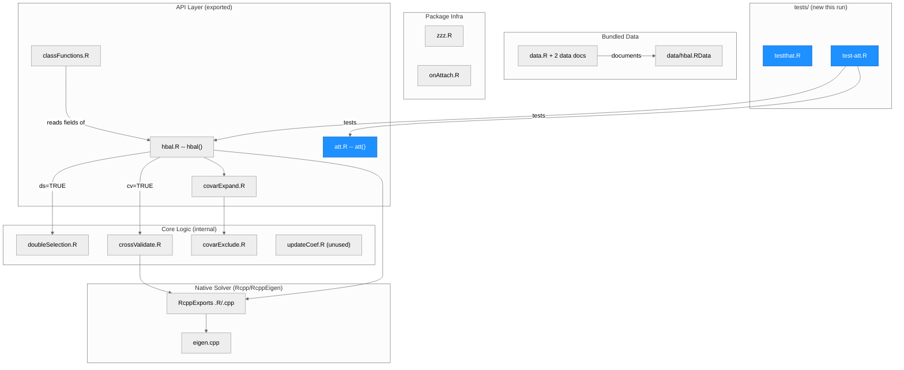
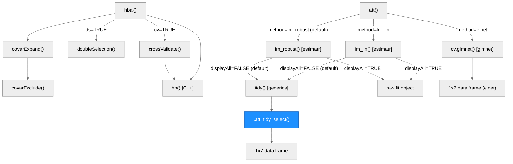
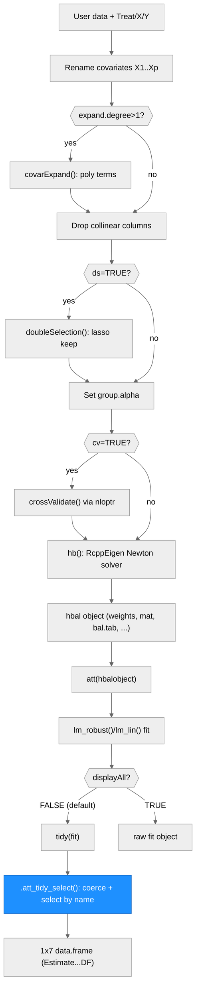

# Architecture — hbal

> Generated by scriber for run `2026-09-16-estimatr-tibble-rownames` on 2026-09-16. This is hbal's first StatsClaw run, so this document is the package's initial architecture map, not a diff against a prior version.

## Overview

hbal is an R package implementing hierarchically regularized entropy balancing (Xu and Yang, 2022, *Political Analysis*, doi:10.1017/pan.2022.12) for estimating the average treatment effect on the treated (ATT) under binary treatment and strong ignorability. Given treatment, outcome, and covariates, `hbal()` reweights the control group so its covariate distribution matches the treatment group's: it automatically expands the covariate space to higher-order (squared/cubic/interaction) terms and uses cross-validated ridge-type penalties — grouped hierarchically by term order — to control how tightly each group of terms is balanced. The reweighting itself is solved by a compiled Newton solver (`hb()`, RcppEigen) under `src/`. `att()` then estimates the ATT from the balanced sample via one of three independent estimators (`estimatr::lm_robust`, `estimatr::lm_lin`, or a `glmnet`-based approximate-residual-balancing method). The package is a small, single-purpose R + C++ hybrid: 14 R files (~1,330 lines) plus a 2-file, ~385-line RcppEigen core, one compiled entry point (`hb()`), two bundled real-data examples (`lalonde`, `contenderJudges`), and, as of this run, a first `tests/testthat/` suite. Key external dependencies: `estimatr` (ATT regression), `glmnet` (double selection and the `elnet` ATT method), `nloptr` (COBYLA search over group penalties), `Rcpp`/`RcppEigen` (the solver), and `ggplot2`/`gridExtra`/`stringr` (balance plots).

---

## Module Structure

> One unified diagram, subgraph layers group related files. Blue fill = touched by this run (`R/att.R`'s content, and the two brand-new `tests/` files). `updateCoef.R` and the package-infra files (`zzz.R`, `onAttach.R`) are intentionally drawn with no outgoing edges — they are not called by, or do not call, any other module (see Notes).

### Module Reference

| Module / File | Layer | Purpose | Key Exports | Changed |
| --- | --- | --- | --- | --- |
| `R/hbal.R` | API | Main entry point: renames/expands covariates, cross-validates group penalties, calls the C++ solver, assembles the `hbal` object | `hbal()` | no |
| `R/att.R` | API | ATT estimator wrapper around `estimatr`/`glmnet`; three estimator paths (`lm_robust`, `lm_lin`, `elnet`) | `att()`, internal `.att_tidy_select()` | **yes** |
| `R/covarExpand.R` | API | Serial polynomial expansion (2nd/3rd degree) of covariates | `covarExpand()` | no |
| `R/classFunctions.R` | API | S3 methods for the `hbal` class | `summary.hbal()`, `plot.hbal()` | no |
| `R/doubleSelection.R` | Core | Lasso-based double selection of covariates (`ds = TRUE`) | `doubleSelection()` (internal) | no |
| `R/crossValidate.R` | Core | Per-fold CV loss, used as the `nloptr` objective for group-penalty search | `crossValidate()` (internal) | no |
| `R/covarExclude.R` | Core | Matches expanded-term column names against a user exclude list | `covarExclude()` (internal) | no |
| `R/updateCoef.R` | Core | Weighted running average of `lambda` across CV folds | `updateCoef()` (internal) | no -- currently unreferenced anywhere in `R/` or `src/` (dead code; see Notes) |
| `R/RcppExports.R` + `src/RcppExports.cpp` | Native | `Rcpp::compileAttributes()`-generated `.Call` bridge | `hb()`, `line_searcher()` (both internal) | no |
| `src/eigen.cpp` | Native | RcppEigen implementation of the entropy-balancing Newton solver and its Brent-method line search | `hb()`, `line_searcher()`, `line_searcher_internal()`, `Brent_fmin()` (last two C++-only) | no |
| `R/data.R`, `R/lalonde-data.R`, `R/contenderJudges-data.R` | Data | roxygen documentation stubs for the bundled datasets (no executable code) | `lalonde`, `contenderJudges`, `hbal-data` doc topics | no |
| `data/hbal.RData` | Data | Bundled `lalonde` and `contenderJudges` data frames (`LazyData: true`) | -- | no |
| `R/zzz.R` | Infra | Package-level roxygen anchor for the `?hbal` help topic; no runtime code | -- | no |
| `R/onAttach.R` | Infra | `.onAttach()` startup message | `.onAttach()` (internal) | no |
| `tests/testthat.R` | Tests | Standard `testthat` runner (`test_check("hbal")`) | -- | **yes (new)** |
| `tests/testthat/test-att.R` | Tests | 3 `test_that()` blocks / 20 expectations covering `att()`'s shape/warning contract and `.att_tidy_select()` directly | -- | **yes (new)** |

---

## Function Call Graph

> Blue node = new this run. Left tree: `hbal()`'s fitting pipeline. Right tree: `att()`'s estimator dispatch. `.att_tidy_select()` is the only new function; everything else in this diagram is pre-existing and untouched by this run (confirmed against `git diff 2783d63 a60fc08 -- R/att.R`, which shows zero changed lines in the `elnet` branch or the `lm_robust`/`lm_lin` fitting calls themselves).

### Function Reference

| Function | Defined In | Called By | Calls | Changed | Purpose |
| --- | --- | --- | --- | --- | --- |
| `hbal()` | `R/hbal.R` | user / exported | `covarExpand()`, `doubleSelection()`, `crossValidate()` (via `nloptr`), `hb()` | no | Main entry point |
| `covarExpand()` | `R/covarExpand.R` | `hbal()`, user / exported | `covarExclude()`, `stats::poly()` | no | Serial polynomial expansion of covariates |
| `covarExclude()` | `R/covarExclude.R` | `covarExpand()` | -- | no | Column-name exclusion matcher |
| `doubleSelection()` | `R/doubleSelection.R` | `hbal()` (`ds = TRUE`) | `glmnet::cv.glmnet()` | no | Lasso double selection of covariates |
| `crossValidate()` | `R/crossValidate.R` | `hbal()` (`cv = TRUE`, as `nloptr` objective) | `hb()` | no | Per-fold CV loss for group-penalty search |
| `hb()` | `src/eigen.cpp` (via `R/RcppExports.R`) | `hbal()`, `crossValidate()` | `line_searcher()`, `Brent_fmin()` (C++-internal) | no | Compiled entropy-balancing Newton solver |
| `att()` | `R/att.R` | user / exported | `lm_robust()`, `lm_lin()`, `cv.glmnet()`, `tidy()`, `.att_tidy_select()` | **yes** | ATT estimator wrapper (3 methods + `displayAll`) |
| `.att_tidy_select()` | `R/att.R` | `att()` | `as.data.frame()`, `stop()` | **yes (new)** | Coerces `tidy()`'s output to a plain `data.frame` and selects the treatment row (`term == Tr`) and the seven display columns by name -- the actual fix this run makes |
| `summary.hbal()` | `R/classFunctions.R` | user / exported (S3) | -- (reads `hbal` object fields) | no | Prints call, group counts/penalties, balance table |
| `plot.hbal()` | `R/classFunctions.R` | user / exported (S3) | `ggplot2`, `gridExtra`, `stringr` | no | Covariate-balance / weight-distribution plots |

---

## Data Flow

> Vertical flowchart, diamonds are decision points, blue = changed this run. `method = "elnet"` is not shown (it never reaches `FIT`/`TIDYCALL`/`SELECT`): from `ATTCALL` it branches directly to its own `cv.glmnet()`-based construction of a 1x7 `data.frame`, unconditionally, regardless of `displayAll` — see the Function Call Graph above for that branch in full.

---

## Key Data Structures

### The `hbal` object (`hbal()`'s return value)

| Field | Type | Description |
| --- | --- | --- |
| `converged` | logical | whether `hb()`'s Newton solver converged within `max.iterations` |
| `weights` | numeric, length N | treated units keep their base weight; control units get the balancing weight |
| `weights.co` | numeric, length N.control | control-group balancing weights only, normalized to sum to the treated total |
| `coefs` | numeric | final Lagrangian multipliers (`lambda`) from the solver |
| `Treatment` | numeric 0/1, length N | treatment indicator, named by `Treat` |
| `mat` | matrix | the (possibly expanded) covariate matrix actually balanced on |
| `grouping` | named integer vector | number of terms in each penalty group (e.g. linear / squared / two-way) |
| `group.penalty` | named numeric vector | selected (cross-validated or user-supplied) `alpha` penalty per group |
| `term.penalty` | named numeric vector | per-term penalty, expanded from `group.penalty` via `grouping` |
| `bal.tab` | matrix | balance table: `Tr.Mean`, `Co.Mean`, `W.Co.Mean`, `Std.Diff.(O)`, `Std.Diff.(W)` |
| `base.weights` | numeric | user-supplied base weights (or all-1s) prior to balancing |
| `Treat` | character(1) | name of the treatment variable -- this is `Tr` downstream in `att()` |
| `Outcome`, `Y` | vector, character(1) | present only if `Y` was supplied to `hbal()` |
| `call` | language | the matched call (`match.call()`), printed by `summary.hbal()` |
| *(class)* | `"hbal"` | S3 class dispatching `summary.hbal()` / `plot.hbal()` |

### `att()`'s three estimator paths and the `displayAll` contract

| `method` | Underlying fit | `dr` | `displayAll` behavior |
| --- | --- | --- | --- |
| `"lm_robust"` (default) | `estimatr::lm_robust()` | `TRUE` (default): `Y ~ Tr + covariates`; `FALSE`: `Y ~ Tr` only | `FALSE` (default) -> 1x7 `data.frame` via `.att_tidy_select()`; `TRUE` -> raw `lm_robust` fit object |
| `"lm_lin"` | `estimatr::lm_lin()` (Lin 2013 centered/interacted regression) | not applicable (`lm_lin` always includes centered, interacted covariates) | same as above |
| `"elnet"` | `glmnet::cv.glmnet()` (Athey 2018 approximate residual balancing) | not applicable | **always** returns its own 1x7 `data.frame`, built without ever calling `tidy()` -- `displayAll` is ignored entirely, because this branch `return()`s before the `displayAll` check is reached |

This last row is a real, easy-to-miss interaction between two arguments that otherwise look independent; it is now correctly stated in `man/att.Rd`'s `\value{}` block as of this run's builder edit (previously the block just said "A matrix of estimates with their robust standard errors", which described neither the class nor this interaction).

---

## Testing

Before this run, hbal shipped with **no `tests/` directory at all** -- validation was build + check + the package's own three `@examples` blocks. This run adds the package's first tests:

- **`tests/testthat.R`** -- the standard 3-line `testthat` runner (`test_check("hbal")`), wired up via `Suggests: testthat (>= 3.0.0)` and a new `Config/testthat/edition: 3` field in `DESCRIPTION`.
- **`tests/testthat/test-att.R`** -- 3 `test_that()` blocks / 20 expectations:
  1. an integration test that fits a real, small (`N = 100`) `hbal()` model and calls `att()` four ways (default, `method = "lm_lin"`, `dr = FALSE`, `se_type = "HC2"`), asserting the documented shape/class/no-warning contract end to end, under whichever `estimatr` is actually installed;
  2. a direct unit test of `.att_tidy_select()` against a hand-built object with `class(x) <- c("tbl_df", "tbl", "data.frame")` -- this is what makes the estimatr-2.0.0 tibble code path regression-testable in CI, which only ever installs CRAN estimatr 1.0.6 and therefore cannot otherwise exercise this fix's actual bug path;
  3. error-path tests confirming `.att_tidy_select()` raises via `stop()` on a missing treatment term, a duplicated term, and a missing required column.

All 20 expectations pass under both estimatr 1.0.6 and estimatr 2.0.0 (`runs/2026-09-16-estimatr-tibble-rownames/audit.md` §8.2). `R CMD check --as-cran` picks the suite up automatically (`checking tests ... Running 'testthat.R' ... OK`).

---

## CI/CD & Branch Model

- **`.github/workflows/R-CMD-check.yaml`**: a standard `r-lib/actions` R CMD check matrix across 5 configs (macOS-release, Windows-release, Ubuntu-devel/release/oldrel-1). As of this run, it triggers on `push` and `pull_request` to both `main` and `dev` (previously `main` only), so PRs opened against the new `dev` integration branch get CI coverage. No other line of the workflow file changed this run.
- **Branch model** (adopted 2026-09-16): `main` == the CRAN-released code (branch-protected on GitHub -- PR required, 0 approvals needed, enforced for admins too, no force-push/deletion, no required status checks yet). `dev` is an unprotected integration branch, created off `main`, that feature branches PR into. Feature branches (e.g. `fix/estimatr-2.0-tidy`, this run) branch off `dev` and PR back into `dev`. `dev -> main` happens only at a CRAN release.
- **CI blind spot**: every CI job installs `estimatr` from CRAN (1.0.6), so CI alone cannot exercise the estimatr-2.0.0-tibble code path this run fixes. That coverage comes from (a) this run's local two-library validation (`audit.md`'s full battery under both estimatr 1.0.6 and a `DeclareDesign/estimatr@rewrite` 2.0.0 build) and (b) the new `.att_tidy_select()` unit test's hand-built tibble-classed stub (Testing, above), which *is* CI-visible even though CI itself never installs estimatr 2.0.0.

---

## Architectural Patterns

- **Hierarchical group-penalty regularization**: covariates are grouped by term order (linear, squared, two-way, cubic, ...) via `grouping`; a single `alpha` penalty per group -- searched by `crossValidate()`/`nloptr` when `cv = TRUE`, or supplied directly via `group.alpha`/`term.alpha` -- is expanded to a per-term penalty vector and passed to the compiled solver `hb()`. `linear.exact = TRUE` (the default) hardwires the first (linear) group's penalty to exact balance.
- **R/C++ split at exactly one function**: all numerically intensive work (the Lagrangian/Newton solve for balancing weights) lives in `hb()` (`src/eigen.cpp`, RcppEigen), called from two R call sites (`hbal()`'s final fit, and `crossValidate()`'s inner CV loop). Everything else -- data prep, covariate expansion, double selection, CV orchestration, ATT estimation -- is plain R.
- **Version-agnostic consumption of external return types** (this run): `att()` is the package's only consumer of `estimatr`'s `tidy()` output (confirmed by grep across `R/`, `NAMESPACE`, `man/`, `vignettes/`; see `impact.md`). Before this run, `att()` implicitly assumed `tidy()` always returns a plain `data.frame` (true only for estimatr < 2.0.0) and indexed/row-named it positionally -- which breaks under a tibble. `.att_tidy_select()` makes that boundary explicit: coerce to `data.frame` first, then select the treatment row by `term == Tr` and the seven display columns by name. Both changes are pure hardening: output is bit-identical to the pre-fix implementation for every case reachable today (see `log-entry.md` for the full before/after).
- **Three independent ATT estimators behind one interface**: `att()`'s `method` argument dispatches to `lm_robust` (default; doubly robust when `dr = TRUE`), `lm_lin` (Lin 2013 interacted/centered regression), or `elnet` (Athey 2018 approximate residual balancing via `glmnet::cv.glmnet`). See "Key Data Structures" above for the full `displayAll` interaction.
- **S3 pair pattern**: `summary.hbal()` / `plot.hbal()` both dispatch on the `hbal` class and read the fitted object's fields directly (`$bal.tab`, `$grouping`, `$group.penalty`, ...) rather than recomputing anything from the original data.

---

## Notes

- `updateCoef()` (`R/updateCoef.R`) has no call sites anywhere in `R/` or `src/` as of this run -- it is dead code (a weighted running-average helper, presumably left over from an earlier cross-validation design). Not removed here: it is outside scriber's write surface this run (`R/` is builder's surface only); flagged here for a future cleanup pass.
- The Rcpp-exported `line_searcher()` (`R/RcppExports.R`) is reachable from R via `.Call` but is never called from the package's own R code -- only the like-named C++ function inside `src/eigen.cpp` is used, internally, by `hb()`'s Newton step. The R-level export looks like low-level access left in for debugging/testing the compiled step rather than something end users are meant to call directly (it has no roxygen documentation and is not in `NAMESPACE`'s `export()` list).
- **Pre-existing documentation defect found while reading (not fixed this run -- `R/hbal.R` and `man/hbal.Rd` are outside this run's write surface)**: `hbal()`'s roxygen `@param cv` (and the generated `man/hbal.Rd`) reads "whether to use cross validation. Default is `TRUE`." The formal argument's actual default is `cv = NULL` (correctly shown in both files' own `@usage`/`\usage{}` blocks), and `hbal()`'s body resolves a `NULL` `cv` to `FALSE`, not `TRUE` (`R/hbal.R`, the "Prepare for cross-validation" block: `if (is.null(cv) == FALSE) {...} else { cv <- FALSE }`) -- so by default, calling `hbal()` with none of `cv`/`group.alpha`/`term.alpha` set performs **no** cross-validated penalty search at all (`group.alpha` is set to all-zero instead). This is recorded in `docs.md` and `mailbox.md` for the maintainer, per this run's scope (it is unrelated to the estimatr/tidy() fix and not a file scriber is permitted to touch this run).
- Three open, unmerged external PRs touch files this document describes, none reviewed or acted on by this run: **#8** (soodoku) -- the `dr`/`method == "lin"` guard at `R/att.R` lines 43-49 compares against the literal string `"lin"`, which `method` is never actually set to (`"lm_lin"` is), so `dr = FALSE` silently has no effect when `method = "lm_lin"`; **#7** (soodoku) -- a covariate-rename collision in `R/hbal.R`; **#4** (joshuafayallen) -- a new weight-extraction generic.
- `NEWS.md` has no entries for 1.2.14/1.2.15 (both were bumped on CRAN without a NEWS entry, before this run); this run's own 1.2.16 entry does not backfill them, per `spec.md` §2.4.
- Total R source: 1,332 lines across 14 files. Total C++ source: 385 lines across 2 files. Total test source (new this run): 73 lines across 2 files.

---

## Upcoming

- `2026-09-16-orthogonal-att` (branch `feat/orthogonal-att`, to be branched off this run's `fix/estimatr-2.0-tidy`) is queued but **not started** as of this document: it will replace `att()`'s default ATT estimator with a Neyman-orthogonal one, keep the existing `lm_robust`/`lm_lin`/`elnet` paths available under a non-default option, and bump the package to 1.3.0. `.att_tidy_select()` (this run) was deliberately scoped to "select and relabel a tidy-shaped data.frame's treatment row" only (per `spec.md` §7), so it should not need to change for that companion run. This section will be updated by scriber once that run completes.
