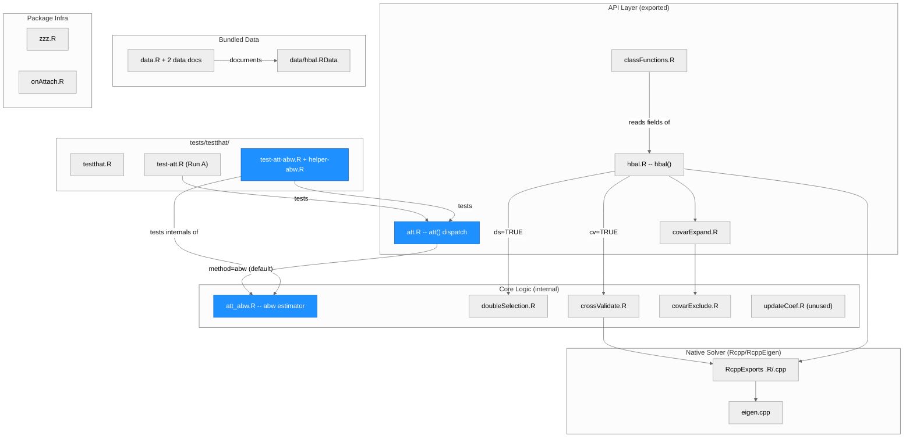
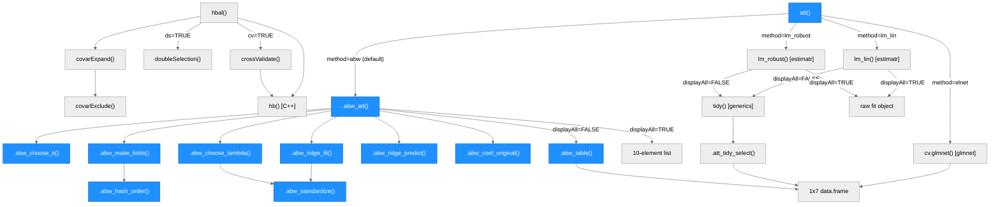
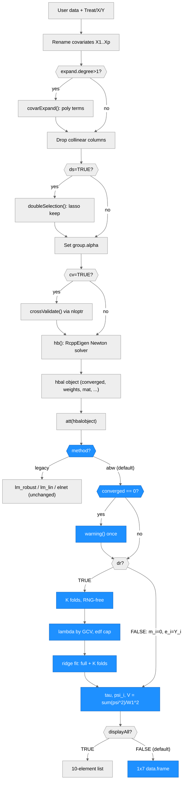

# Architecture — hbal

> Generated by scriber for run `2026-09-16-orthogonal-att` on 2026-09-16 (hbal 1.3.0, branch `feat/orthogonal-att`). Supersedes the first edition written for run `2026-09-16-estimatr-tibble-rownames` (hbal 1.2.16) earlier the same day; the "Run history" section at the end says what each run changed.

## Overview

hbal is an R package implementing hierarchically regularized entropy balancing (Xu and Yang, 2022, *Political Analysis*, doi:10.1017/pan.2022.12) for estimating the average treatment effect on the treated (ATT) under binary treatment and strong ignorability. Given treatment, outcome, and covariates, `hbal()` reweights the control group so its covariate distribution matches the treatment group's: it automatically expands the covariate space to higher-order (squared/cubic/interaction) terms and uses cross-validated ridge-type penalties — grouped hierarchically by term order — to control how tightly each group of terms is balanced. The reweighting itself is solved by a compiled Newton solver (`hb()`, RcppEigen) under `src/`. `att()` then estimates the ATT from the balanced sample. As of 1.3.0 its default is a cross-fitted, Neyman-orthogonal augmented balancing weights estimator (`method = "abw"`, all logic in the new `R/att_abw.R`, base R only); the three earlier estimators (`estimatr::lm_robust`, `estimatr::lm_lin`, and a `glmnet`-based approximate-residual-balancing method) remain selectable and numerically unchanged. The package is a small R + C++ hybrid: 15 R files (~1,860 lines) plus a 2-file, ~385-line RcppEigen core, one compiled entry point (`hb()`), two bundled real-data examples (`lalonde`, `contenderJudges`), and a `tests/testthat/` suite (24 `test_that()` blocks / 85 expectations across two test files). Key external dependencies: `estimatr` (legacy ATT regressions), `glmnet` (double selection and the `elnet` ATT method), `nloptr` (COBYLA search over group penalties), `Rcpp`/`RcppEigen` (the solver), and `ggplot2`/`gridExtra`/`stringr` (balance plots). The default ATT path adds no dependency.

---

## Module Structure



> One unified diagram, subgraph layers group related files. Blue fill = created or changed by this run (`R/att.R`'s dispatch and roxygen, the new `R/att_abw.R`, the new test files). `R/hbal.R` and `man/hbal.Rd` received a one-line documentation addition (the `converged` element) and no code change, so they are not marked. `updateCoef.R`, `zzz.R`, and `onAttach.R` are drawn with no edges: they are not called by, and do not call, any other module (see Notes).

### Module Reference

| Module / File | Layer | Purpose | Key Exports | Changed |
| --- | --- | --- | --- | --- |
| `R/hbal.R` | API | Main entry point: renames/expands covariates, cross-validates group penalties, calls the C++ solver, assembles the `hbal` object | `hbal()` | docs only (roxygen `@return` gains the `converged` item; body untouched) |
| `R/att.R` | API | ATT estimator dispatch: `abw` (default, first branch, self-contained early return), then `lm_robust`, `lm_lin`, `elnet`, then a final `else stop()`; validates `...`/`nfolds`/`seed` for `abw` | `att()`, internal `.att_tidy_select()` | **yes** |
| `R/att_abw.R` | Core | The augmented balancing weights estimator: RNG-free fold assignment, fold-count rule, per-fold-standardized ridge outcome model, GCV penalty choice under an edf cap, moment condition, influence-function variance, the 1x7 display table | none exported; 11 `@noRd` helpers + 8 constants (see Function Reference) | **yes (new)** |
| `R/covarExpand.R` | API | Serial polynomial expansion (2nd/3rd degree) of covariates | `covarExpand()` | no |
| `R/classFunctions.R` | API | S3 methods for the `hbal` class | `summary.hbal()`, `plot.hbal()` | no |
| `R/doubleSelection.R` | Core | Lasso-based double selection of covariates (`ds = TRUE`) | `doubleSelection()` (internal) | no |
| `R/crossValidate.R` | Core | Per-fold CV loss, used as the `nloptr` objective for group-penalty search | `crossValidate()` (internal) | no |
| `R/covarExclude.R` | Core | Matches expanded-term column names against a user exclude list | `covarExclude()` (internal) | no |
| `R/updateCoef.R` | Core | Weighted running average of `lambda` across CV folds | `updateCoef()` (internal) | no -- unreferenced anywhere in `R/` or `src/` (dead code; see Notes) |
| `R/RcppExports.R` + `src/RcppExports.cpp` | Native | `Rcpp::compileAttributes()`-generated `.Call` bridge | `hb()`, `line_searcher()` (both internal) | no |
| `src/eigen.cpp` | Native | RcppEigen implementation of the entropy-balancing Newton solver and its Brent-method line search | `hb()`, `line_searcher()`, `line_searcher_internal()`, `Brent_fmin()` (last two C++-only) | no |
| `R/data.R`, `R/lalonde-data.R`, `R/contenderJudges-data.R` | Data | roxygen documentation stubs for the bundled datasets (no executable code) | `lalonde`, `contenderJudges`, `hbal-data` doc topics | no |
| `data/hbal.RData` | Data | Bundled `lalonde` and `contenderJudges` data frames (`LazyData: true`) | -- | no |
| `R/zzz.R` | Infra | Package-level roxygen anchor for the `?hbal` help topic; no runtime code | -- | no |
| `R/onAttach.R` | Infra | `.onAttach()` startup message | `.onAttach()` (internal) | no |
| `tests/testthat.R` | Tests | Standard `testthat` runner (`test_check("hbal")`) | -- | no (Run A) |
| `tests/testthat/test-att.R` | Tests | Run A's 3 blocks / 20 expectations: `att()` shape/warning contract and `.att_tidy_select()` | -- | one line: its `se_type = "HC2"` call now names `method = "lm_robust"` (the default rejects `...`) |
| `tests/testthat/helper-abw.R` | Tests | Three fixtures: `make_toy()` (converged, n0 = 150), `make_small_toy()` (n0 = 10, forces K = 1), `make_wide_toy()` (degree 3, p = 15, n0 = 60, non-converged) | -- | **yes (new)** |
| `tests/testthat/test-att-abw.R` | Tests | 21 blocks / 65 expectations covering the new default and the legacy paths (see Testing) | -- | **yes (new)** |
| `vignettes/tutorial.Rmd` (+ `references.bib`) | Docs | Package tutorial; `.Rbuildignore`-excluded, so never built by `R CMD check` | -- | **yes**: "Obtaining the ATT" section rewritten for the new default; four bib entries added |
| `ARCHITECTURE.md` | Docs | This document (`.Rbuildignore`-excluded) | -- | **yes** |

---

## Function Call Graph



> Blue nodes = new or changed this run. Left tree: `hbal()`'s fitting pipeline (unchanged). Right tree: `att()`'s dispatch. The `abw` branch is checked first and returns early for both `displayAll` values; it never reaches `tidy()` or `.att_tidy_select()`, so it is textually and logically disjoint from Run A's fix in the `lm_robust`/`lm_lin` tail. The three legacy branch bodies are byte-identical to 1.2.16 (`git diff` shows only their `if` -> `else if` head lines). `elnet` always returns its own 1x7 data.frame regardless of `displayAll` (pre-existing).

### Function Reference

| Function | Defined In | Called By | Calls | Changed | Purpose |
| --- | --- | --- | --- | --- | --- |
| `hbal()` | `R/hbal.R` | user / exported | `covarExpand()`, `doubleSelection()`, `crossValidate()` (via `nloptr`), `hb()` | no | Main entry point; stores `$converged` as an integer 0/1 from the solver |
| `covarExpand()` | `R/covarExpand.R` | `hbal()`, user / exported | `covarExclude()`, `stats::poly()` | no | Serial polynomial expansion of covariates |
| `covarExclude()` | `R/covarExclude.R` | `covarExpand()` | -- | no | Column-name exclusion matcher |
| `doubleSelection()` | `R/doubleSelection.R` | `hbal()` (`ds = TRUE`) | `glmnet::cv.glmnet()` | no | Lasso double selection of covariates |
| `crossValidate()` | `R/crossValidate.R` | `hbal()` (`cv = TRUE`, as `nloptr` objective) | `hb()` | no | Per-fold CV loss for group-penalty search |
| `hb()` | `src/eigen.cpp` (via `R/RcppExports.R`) | `hbal()`, `crossValidate()` | `line_searcher()`, `Brent_fmin()` (C++-internal) | no | Compiled entropy-balancing Newton solver |
| `att()` | `R/att.R` | user / exported | `.abw_att()`, `.abw_table()`, `lm_robust()`, `lm_lin()`, `cv.glmnet()`, `tidy()`, `.att_tidy_select()` | **yes** | Dispatch on `method` (default `"abw"`); validates `...` (rejected under `abw`), `nfolds`, `seed`; final `else stop()` for an unrecognized method |
| `.abw_att()` | `R/att_abw.R` | `att()` | `.abw_choose_k()`, `.abw_make_folds()`, `.abw_choose_lambda()`, `.abw_ridge_fit()`, `.abw_ridge_predict()`, `.abw_coef_original()` | **new** | The estimator: warns once if `$converged` is 0 (either `dr`); builds `m_i`, cross-fitted `e_i`, the point estimate, the per-unit moment contributions `psi_i`, and the variance `sum(psi^2) / W1^2`; returns the 10-element list |
| `.abw_choose_k()` | `R/att_abw.R` | `.abw_att()` | -- | **new** | `K = max(1, min(nfolds, floor(n0 / (2p))))`; one `message()` (never a warning) when `K != nfolds` |
| `.abw_make_folds()` | `R/att_abw.R` | `.abw_att()` | `.abw_hash_order()` | **new** | Fold labels 1..K interleaved over the (permuted) controls |
| `.abw_hash_order()` | `R/att_abw.R` | `.abw_make_folds()` | `order()` | **new** | `seed = NULL`: identity order; otherwise a multiplicative hash `(j * 2654435761 + seed * 2246822519) mod 2^32` -- no RNG call anywhere |
| `.abw_choose_lambda()` | `R/att_abw.R` | `.abw_att()` (once per call, full control sample) | `.abw_standardize()`, `solve()` | **new** | GCV (Golub, Heath and Wahba 1979) over `.ABW_LAMBDA_GRID` (0 and 10^(-8..6 by 0.25), 58 points), restricted to candidates with `edf(lambda) <= min(p, n0/2) + 1`; returns `list(lambda, edf, cap, n_eligible)` |
| `.abw_standardize()` | `R/att_abw.R` | `.abw_ridge_fit()`, `.abw_choose_lambda()` | `scale()` | **new** | One column standardization (training rows' own mean/sd; zero-sd columns get scale 1) shared by the fit and the penalty choice |
| `.abw_ridge_fit()` | `R/att_abw.R` | `.abw_att()` (full sample + each fold) | `.abw_standardize()`, `qr()`, `solve()` | **new** | Weighted ridge solve on the standardized design, intercept unpenalized; `lambda = 0` reproduces `lm.wfit()`; `solve()` failure falls back to the intercept-only fit; returns `beta_std`, `center`, `scale`, `rank` |
| `.abw_ridge_predict()` | `R/att_abw.R` | `.abw_att()` | `scale()` | **new** | Standardizes new rows with the fit's own center/scale and multiplies out |
| `.abw_coef_original()` | `R/att_abw.R` | `.abw_att()` | -- | **new** | Back-transforms `beta_std` to the scale of `mat` (what `nuisance$coef_full`/`coef_folds` expose) |
| `.abw_table()` | `R/att_abw.R` | `att()` (`displayAll = FALSE`) | `stats::qt()`, `stats::pt()` | **new** | The 1x7 display data.frame: `t = est/se`, `p = 2 * pt(-abs(t), n - 1)`, CI via `qt(0.975, n - 1)` |
| `.att_tidy_select()` | `R/att.R` | `att()` (`lm_robust`/`lm_lin`, `displayAll = FALSE`) | `as.data.frame()`, `stop()` | no (Run A) | Coerces `tidy()`'s output to a plain `data.frame` and selects the treatment row and seven display columns by name |
| `summary.hbal()` | `R/classFunctions.R` | user / exported (S3) | -- (reads `hbal` object fields) | no | Prints call, group counts/penalties, balance table |
| `plot.hbal()` | `R/classFunctions.R` | user / exported (S3) | `ggplot2`, `gridExtra`, `stringr` | no | Covariate-balance / weight-distribution plots |

Constants in `R/att_abw.R` (all `@noRd`): `.ABW_HASH_A = 2654435761`, `.ABW_HASH_B = 2246822519`, `.ABW_HASH_MOD = 2^32`, `.ABW_CI_PROB = 0.975`, `.ABW_CONTROLS_PER_FOLD_PER_COVARIATE = 2`, `.ABW_LAMBDA_GRID`, `.ABW_EDF_TOL = 1e-8` (slack so the unpenalized fit, `edf = p + 1`, stays admissible against a cap of exactly `p + 1`), `.ABW_GCV_DENOM_TOL = 1e-8`.

---

## Data Flow



> Vertical flowchart, diamonds are decision points, blue = new or changed this run. The legacy node stands for the whole pre-1.3.0 path (see Run A's Data Flow: `lm_robust()`/`lm_lin()` fit -> `tidy()` -> `.att_tidy_select()` -> 1x7 data.frame, or the raw fit object under `displayAll = TRUE`; `elnet` builds its own 1x7 data.frame). `dr = FALSE` under `abw` skips folds, penalty, and fits entirely and plugs `m_i = 0`, `e_i = Y_i` into the same moment formula, which reduces to the weighted difference in means with the matching sandwich standard error.

### The `abw` estimator in one paragraph

With `w_i` the base weights of the treated units, `W1` their sum, `gamma_i` the hbal weights of the controls (`weights.co`, which also sum to `W1`), `m_i` the control-only ridge outcome model evaluated at treated unit `i`, and `e_i` the cross-fitted residual of control `i`:

```
tau   = (1 / W1) * [ sum_{T=1} w_i (Y_i - m_i)  -  sum_{T=0} gamma_i e_i ]
psi_i = w_i T_i (Y_i - m_i - tau) - gamma_i (1 - T_i) e_i        (sums to zero at tau)
V     = sum_i psi_i^2 / W1^2,   SE = sqrt(V),   DF = n - 1
```

The Gateaux derivative of `tau` with respect to the outcome model in any direction `h` is `-(1/W1) [sum_{T=1} w_i h(X_i) - sum_{T=0} gamma_i h(X_i)]`, which hbal's balance on `mat` makes zero (exactly for the linear block under `linear.exact = TRUE`, and for all of `mat` when the hbal call used `cv = FALSE`); the derivative with respect to the weights, at the true outcome model, has mean zero by construction. That two-legged statement is what "Neyman-orthogonal" means here, and why the standard error can treat both nuisances as fixed. Under exact balance on every column of `mat` and no cross-fitting (K = 1), `abw`, `lm_robust`, and `dr = FALSE` coincide algebraically (unit test 7 checks this on a fixture that forces K = 1).

---

## Key Data Structures

### The `hbal` object (`hbal()`'s return value)

| Field | Type | Description |
| --- | --- | --- |
| `converged` | **integer 0/1** (not logical -- it comes straight from the C++ solver; `isTRUE(out$converged)` is always `FALSE`, use `as.logical()`) | whether `hb()`'s Newton solver converged within `max.iterations`; `hbal()` prints a `message()` when 0, and `att(method = "abw")` warns. Documented in `man/hbal.Rd` as of this run |
| `weights` | numeric, length N | treated units keep their base weight; control units get the balancing weight |
| `weights.co` | numeric, length N.control | control-group balancing weights only, normalized so `sum(weights.co) == sum(base weights of the treated)` (`R/hbal.R` line 550) |
| `coefs` | numeric | final Lagrangian multipliers (`lambda`) from the solver |
| `Treatment` | numeric 0/1, length N | treatment indicator (its `names` attribute is a cosmetic artifact: first element named after `Treat`, the rest `NA`) |
| `mat` | matrix | the (possibly expanded) covariate matrix actually balanced on, unscaled, columns renamed `<name>.<position>` (e.g. `X1.1`, `X1.X2.4`) |
| `grouping` | named integer vector | number of terms in each penalty group (e.g. linear / squared / two-way) |
| `group.penalty` | named numeric vector | selected (cross-validated or user-supplied) `alpha` penalty per group |
| `term.penalty` | named numeric vector | per-term penalty, expanded from `group.penalty` via `grouping` |
| `bal.tab` | matrix | balance table: `Tr.Mean`, `Co.Mean`, `W.Co.Mean`, `Std.Diff.(O)`, `Std.Diff.(W)` |
| `base.weights` | numeric | user-supplied base weights (or all-1s) prior to balancing |
| `Treat` | character(1) | name of the treatment variable -- this is `Tr` downstream in `att()` |
| `Outcome`, `Y` | vector, character(1) | present only if `Y` was supplied to `hbal()` |
| `call` | language | the matched call (`match.call()`), printed by `summary.hbal()` |
| *(class)* | `"hbal"` | S3 class dispatching `summary.hbal()` / `plot.hbal()` |

### `att()`'s four estimator paths and the `displayAll` contract

| `method` | Underlying fit | `dr` | `displayAll` behavior | `...` |
| --- | --- | --- | --- | --- |
| `"abw"` (default since 1.3.0) | `R/att_abw.R`: cross-fitted ridge outcome model on the controls + hbal weights, influence-function SE | `TRUE` (default): outcome model on all of `mat`; `FALSE`: weighted difference in means (same moment formula with `m_i = 0`, `e_i = Y_i`) | `FALSE` (default) -> 1x7 `data.frame` via `.abw_table()`; `TRUE` -> plain list with exactly `estimate, se, df, method, dr, influence, fold, nfolds, nuisance (coef_full, coef_folds, rank_full), weights (treated, control)`, same names for either `dr` | rejected with `stop()` naming the offending argument(s) |
| `"lm_robust"` (default before 1.3.0) | `estimatr::lm_robust()` with the hbal weights, `se_type = "stata"` unless overridden | `TRUE`: `Y ~ Tr + covariates`; `FALSE`: `Y ~ Tr` only | `FALSE` -> 1x7 `data.frame` via `tidy()` + `.att_tidy_select()`; `TRUE` -> raw `lm_robust` fit | passed through (`se_type`, `clusters`, ...) |
| `"lm_lin"` | `estimatr::lm_lin()` (Lin 2013 centered/interacted regression) | ignored (pre-existing; see PR #8 in Notes) | same as `lm_robust` | passed through |
| `"elnet"` | `glmnet::cv.glmnet()` (Athey, Imbens and Wager 2018 approximate residual balancing) | ignored | **always** its own 1x7 `data.frame`, `displayAll` ignored (the branch returns before the check) | ignored |

`seed` and `nfolds` are validated and used only under `"abw"`; the three legacy methods ignore them silently. Both `DF` conventions coexist: `abw` reports `n - 1` (one target parameter, nuisances treated as fixed), `lm_robust`/`lm_lin` report the regression residual degrees of freedom -- so `att(out, dr = FALSE)` (now `abw`) and `att(out, method = "lm_robust", dr = FALSE)` give the same point estimate with different SE/t/p/CI/DF.

---

## Testing

Two test files, both run by `R CMD check` (`checking tests ... Running 'testthat.R' ... OK`, `[ FAIL 0 | WARN 0 | SKIP 0 | PASS 85 ]`, about 0.5 s under both estimatr 1.0.6 and 2.0.0):

- **`tests/testthat/test-att.R`** (Run A) -- 3 blocks / 20 expectations: `att()`'s shape/no-warning contract on a real `hbal()` fit (its `se_type = "HC2"` call now names `method = "lm_robust"`, since the default rejects `...`), `.att_tidy_select()` on a hand-built tibble-classed stub, and its three error paths.
- **`tests/testthat/test-att-abw.R`** (this run) -- 21 blocks / 65 expectations, fixtures in `helper-abw.R`:
  1-3 determinism (no seed; fixed seed; different seeds change the folds); 4-5 the 1x7 and 10-element output contracts; 6 `dr = FALSE` equals the direct weighted difference in means (1e-8); 7 closed-form agreement under exact balance with the K = 1 fallback (tolerance 0.02, hbal's own `constraint.tolerance` slack); 8-9 white-box perturbation of the fitted predictions via the exposed `weights` list (in-span response below 0.02; out-of-span imbalance recomputed from the raw object to 1e-10); 10-12 legacy guards (`lm_robust` point estimate equals an independent `lm(weights = )` fit; `lm_lin` shape; seeded `elnet` reproducibility); 13-15 validation and fallback (`...` rejected under `abw` but accepted under `lm_robust`; unrecognized method; K = 1 with a message and no warning); 16 the non-convergence warning fires exactly once for either `dr` on `make_wide_toy()` and never on a converged fit; 17 bounded estimate on that wide fixture (`< 20 x diff(range(Y))`; plain WLS gave about 44x, the ridge fit about 0.3x); 18 ridge at `lambda = 0` reproduces `lm.wfit()`; 19 `nuisance$coef_full` is on the scale of `mat` and reproduces the treated predictions implied by `influence`; 20 tester's interpolation-boundary fixture verbatim (seed 5, 80 treated / 15 controls, 4 covariates, degree 2, `rank_full == n0 == 15`; estimate within 1x the outcome range, was 320x before the GCV rule); 21 well-conditioned pin (`make_toy(1)` estimate 0.5082 within 0.01, `lambda < 10`, and the diagnostic helper's return contract).

Tests 16-17 `skip_if()` the wide fixture happens to converge on another platform (non-convergence is a property of the data and the solver; 0 skips locally).

---

## Simulation evidence (lives in the workspace, not in the package)

The Monte Carlo study behind the default change is not part of the package tarball. Code and results live in the StatsClaw workspace: `statsclaw-workspace/hbal/runs/2026-09-16-orthogonal-att/sim/` (harness `run_simulation.R` + `R/*.R`, `README.md`, `results/*.csv`, `results/summary.md`, and two archived earlier runs under `results/archive/`), with the final tables copied to `statsclaw-workspace/hbal/ref/orthogonal-att-simulation.md`. Three DGPs, N in {200, 500, 1000}, R = 1000 paired replications per cell (same data and `hbal()` fit for both arms), 77-84 s on 4 cores. Headline results at the shipped commit (`6d80833`):

| Scenario | What is wrong | `abw` vs `lm_robust` (previous default) |
| --- | --- | --- |
| (b) everything correctly specified, approximate balance on degree-2 terms (`cv = TRUE`) | nothing | `abw` coverage 0.956 / 0.954 / 0.948 and SE ratio 0.995 / 0.997 / 0.992 at N = 200 / 500 / 1000; `lm_robust` coverage 0.945 / 0.941 / 0.929. RMSE slope in log N: -0.56 |
| (c) mild joint misspecification, heterogeneous effect | both nuisances mildly | `\|bias\|` 0.011 / 0.021 / 0.025 vs 0.023 / 0.027 / 0.030 (abw smaller at every N; the blocking criterion); coverage 0.956 / 0.947 / 0.945 vs 0.941 / 0.935 / 0.927 |
| (a) Kang-Schafer nonlinear confounding (`?hbal` Example 2 DGP with a heterogeneous effect) | outcome model severely; a finite polynomial basis cannot represent it | both biased and neither consistent (true ATT 5.79; bias 1.74 / 2.02 / 2.35 vs 2.32 / 2.57 / 2.68). `abw` has the smaller bias but a much larger SD at N = 200 (8.9 vs 2.5), and `hbal()` itself fails to converge in 6.0% of the N = 200 replications. Reported, not gated |

Failure rate 0 / 18,000 attempted `att()` calls. Under the original scenario (a) call (`cv = FALSE`), `hbal()` failed to converge in 51.8% of the N = 200 replications and the `abw` SD there was 13.8; that finding is why the scenario was changed to `cv = TRUE` and why the default now warns on `converged == 0`.

---

## CI/CD & Branch Model

- **`.github/workflows/R-CMD-check.yaml`**: a standard `r-lib/actions` R CMD check matrix across 5 configs (macOS-release, Windows-release, Ubuntu-devel/release/oldrel-1), triggered on `push` and `pull_request` to `main` and `dev` (Run A added `dev`).
- **Branch model** (adopted 2026-09-16): `main` == the CRAN-released code (1.2.15; branch-protected on GitHub -- PR required, 0 approvals needed, enforced for admins too, no force-push/deletion, no required status checks yet). `dev` is an unprotected integration branch that feature branches PR into. `dev -> main` happens only at a CRAN release.
- **This run's branch**: `feat/orthogonal-att` is stacked on Run A's `fix/estimatr-2.0-tidy` (PR #9 into `dev`, open, not merged as of this document). Its PR targets `fix/estimatr-2.0-tidy` so the diff shows only this run's work; GitHub retargets it to `dev` once PR #9 is merged and its branch deleted. Neither PR is merged by the workflow; the maintainer reviews both. Commits on this branch: `689e4cc` (builder, original `"aipw"` implementation), `c6bc32e` (builder respawn 1: rename to `"abw"`, ridge outcome model, convergence warning), `6d80833` (builder respawn 2: GCV penalty with the edf cap), plus scriber's documentation commit.
- **CI blind spots**: every CI job installs `estimatr` from CRAN (1.0.6), so the estimatr-2.0.0 tibble path is covered only by the local two-library validation and the hand-built tibble stub in `test-att.R`. The new default never touches `estimatr`, so it is version-independent by construction (identical output under 1.0.6 and 2.0.0, verified). CI also never sees `vignettes/` or `ARCHITECTURE.md` (both `.Rbuildignore`-excluded).

---

## Architectural Patterns

- **Hierarchical group-penalty regularization**: covariates are grouped by term order (linear, squared, two-way, cubic, ...) via `grouping`; a single `alpha` penalty per group -- searched by `crossValidate()`/`nloptr` when `cv = TRUE`, or supplied directly via `group.alpha`/`term.alpha` -- is expanded to a per-term penalty vector and passed to the compiled solver `hb()`. `linear.exact = TRUE` (the default) hardwires the first (linear) group's penalty to exact balance. With `cv` unset (its default `NULL` resolves to `FALSE`) and no `group.alpha`, every group gets `alpha = 0`, i.e. exact balance is sought on all of `mat`.
- **R/C++ split at exactly one function**: all numerically intensive work (the Lagrangian/Newton solve for balancing weights) lives in `hb()` (`src/eigen.cpp`, RcppEigen), called from two R call sites (`hbal()`'s final fit, and `crossValidate()`'s inner CV loop). Everything else -- data prep, covariate expansion, double selection, CV orchestration, ATT estimation -- is plain R.
- **One estimator, one file, one early return** (this run): everything specific to the default estimator is in `R/att_abw.R` behind `.abw_att()`; `att()` calls it once and builds both output shapes from that single result, and the branch returns before the shared `estimatr`/`tidy()` tail. Adding a fifth `method` means a new file and a new `else if` branch, not edits to existing ones.
- **RNG-free determinism in package code** (this run): `R/att_abw.R` contains no `set.seed()`, `sample()`, `runif()`, or `.Random.seed` access. `seed` selects a fold partition through a multiplicative hash, and the ridge penalty is a deterministic grid search, so `att(out)` is bit-reproducible with or without a seed. This deliberately differs from `hbal()`'s own `seed` argument, which calls bare `set.seed()` (pre-existing), and from `elnet`, whose `cv.glmnet()` folds come from the global RNG stream.
- **Regularized nuisance with a hard admissibility gate** (this run): the outcome model's penalty is chosen by a score (GCV) but only among candidates whose effective degrees of freedom stay at or below `min(p, n0/2) + 1`. A pure plug-in rule failed at the exact interpolation boundary (`rank == n0`) because its residual-variance estimate collapsed to zero there; the cap makes an interpolating fit inadmissible regardless of the score.
- **Version-agnostic consumption of external return types** (Run A): `.att_tidy_select()` coerces `estimatr`'s `tidy()` output to a plain `data.frame` and selects rows/columns by name, so the legacy paths are identical under estimatr 1.0.6 and 2.0.0.
- **S3 pair pattern**: `summary.hbal()` / `plot.hbal()` both dispatch on the `hbal` class and read the fitted object's fields directly rather than recomputing anything from the original data.

---

## Notes

- `updateCoef()` (`R/updateCoef.R`) has no call sites anywhere in `R/` or `src/` -- dead code, presumably left over from an earlier cross-validation design. Not removed (outside every run's write surface so far); flagged for a cleanup pass.
- The Rcpp-exported `line_searcher()` (`R/RcppExports.R`) is reachable from R via `.Call` but never called from the package's own R code; only the like-named C++ function inside `src/eigen.cpp` is used, by `hb()`. Undocumented and not in `NAMESPACE`'s `export()` list.
- **`hbal()` documentation defects, still open** (only the `converged` item was added this run; `R/hbal.R` is otherwise outside scriber's surface): (i) `@param cv` says "Default is `TRUE`" but the formal default is `cv = NULL`, which the body resolves to `FALSE` -- so a bare `hbal()` call does **no** cross-validated penalty search; (ii) the `\value{}` block lists `penalty`, `W`, and `Y` (which do not exist under those names) and omits `weights.co`, `Treatment`, `grouping`, `group.penalty`, `term.penalty`, `bal.tab`, `base.weights`, `Treat`, `Outcome`, and `call`; (iii) the vignette's field list says `mat` includes the outcome and treatment columns, but `mat` holds only the expanded covariates. Recommended: fix the roxygen in `R/hbal.R` and regenerate `man/hbal.Rd` in one documentation-only run.
- **Pre-existing `elnet` quirks, untouched by design** (the legacy paths are byte-identical to 1.2.16): its `cv.glmnet()` folds are unseeded, so results differ across sessions unless the caller sets the seed; its two-sided p-value omits `abs()` (`2 * pt(-t, df)`), and its CI uses a hard-coded 1.96 instead of a `qt()` quantile. The new default does not copy either.
- Three open, unmerged external PRs touch files this document describes, none reviewed or acted on by this run: **#8** (soodoku) -- the `dr`/`method == "lin"` guard at the top of `att()` compares against the literal string `"lin"`, which `method` is never set to (`"lm_lin"` is), so `dr = FALSE` silently has no effect under `lm_lin`; **#7** (soodoku) -- a covariate-rename collision in `R/hbal.R`; **#4** (joshuafayallen) -- a new weight-extraction generic. This run's `R/att.R` diff leaves the guard untouched, so #8 should still apply, but all three should be re-based once `dev` moves.
- `NEWS.md` has no entries for 1.2.14/1.2.15 (bumped on CRAN without a NEWS entry, before these runs); neither run backfilled them.
- Totals: R source 1,863 lines across 15 files (`R/att_abw.R` 404, `R/att.R` 293); C++ 385 lines across 2 files (unchanged); tests 382 lines across 4 files.

---

## Run history

- **`2026-09-16-estimatr-tibble-rownames`** (Run A, hbal 1.2.16, branch `fix/estimatr-2.0-tidy`, PR #9 open): `att()`'s legacy paths coerce `tidy()`'s output to a plain `data.frame` and select by name (`.att_tidy_select()`), fixing a deprecation warning under estimatr 2.0.0; first `tests/testthat/` suite; CI triggers on `dev`; first edition of this document.
- **`2026-09-16-orthogonal-att`** (Run B, this document, hbal 1.3.0, branch `feat/orthogonal-att` stacked on Run A's): `att()`'s default becomes the cross-fitted augmented balancing weights estimator in `R/att_abw.R`; `seed`/`nfolds` arguments; `...` rejected under the default; unrecognized `method` errors; convergence warning; 21 new unit tests; vignette ATT section rewritten; `converged` documented in `man/hbal.Rd`; Monte Carlo evidence in the workspace. Full process record: `statsclaw-workspace/hbal/runs/2026-09-16-orthogonal-att.md`.
