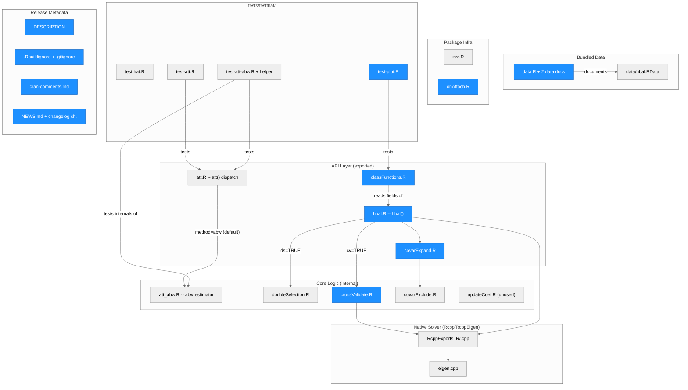
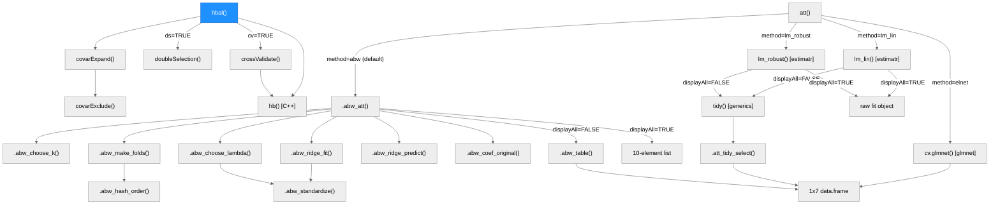
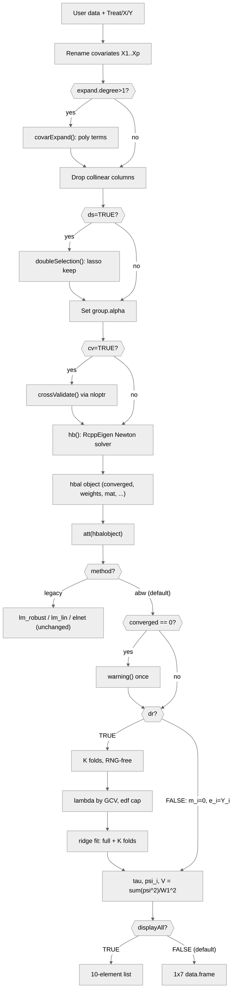

# Architecture — hbal

> Maintained by scriber. Last updated for run `2026-09-17-cran-check-compliance` on 2026-09-17 (hbal 1.3.0, branch `feat/quarto-book`, PR #11). The document's structure comes from run `2026-09-16-orthogonal-att`, which superseded the first edition written for run `2026-09-16-estimatr-tibble-rownames`; the "Run history" section at the end says what each run changed. Throughout, a "Changed" column and a blue diagram node cover the **two release-preparation runs on this branch** — `2026-09-17-cran-release-1.3.0` and `2026-09-17-cran-check-compliance` — which together turn `6c04eda` into the 1.3.0 submission candidate. Earlier runs' changes are recorded in the run history, not in the diagrams.

## Overview

hbal is an R package implementing hierarchically regularized entropy balancing (Xu and Yang, 2022, *Political Analysis*, doi:10.1017/pan.2022.12) for estimating the average treatment effect on the treated (ATT) under binary treatment and strong ignorability. Given treatment, outcome, and covariates, `hbal()` reweights the control group so its covariate distribution matches the treatment group's: it automatically expands the covariate space to higher-order (squared/cubic/interaction) terms and uses cross-validated ridge-type penalties — grouped hierarchically by term order — to control how tightly each group of terms is balanced. The reweighting itself is solved by a compiled Newton solver (`hb()`, RcppEigen) under `src/`. `att()` then estimates the ATT from the balanced sample. As of 1.3.0 its default is a cross-fitted, Neyman-orthogonal augmented balancing weights estimator (`method = "abw"`, all logic in the new `R/att_abw.R`, base R only); the three earlier estimators (`estimatr::lm_robust`, `estimatr::lm_lin`, and a `glmnet`-based approximate-residual-balancing method) remain selectable and numerically unchanged. The package is a small R + C++ hybrid: 15 R files (1,928 lines) plus a 2-file, 385-line RcppEigen core, one compiled entry point (`hb()`), 13 `man/*.Rd` help pages, two bundled real-data examples (`lalonde`, `contenderJudges`), and a `tests/testthat/` suite (27 `test_that()` blocks / 100 expectations across three test files plus a fixture helper). Key external dependencies: `estimatr` (legacy ATT regressions), `glmnet` (double selection and the `elnet` ATT method), `nloptr` (COBYLA search over group penalties), `Rcpp`/`RcppEigen` (the solver), and `ggplot2`/`gridExtra`/`stringr` (balance plots). The default ATT path adds no dependency.

As of run `2026-09-17-cran-check-compliance` the tree is release-ready as **hbal 1.3.0**: `R CMD check --as-cran` on the built tarball is `Status: OK`, 0 errors / 0 warnings / 0 notes, under both estimatr 1.0.6 and the CRAN-published estimatr 2.0.0, and an item-by-item audit against the maintainer's `/cran-check` skill comes back 60 COMPLIES / 0 DOES NOT COMPLY. See "Release readiness — hbal 1.3.0" below for what was checked, what the compliance audit changed, and what the maintainer still has to do.

---

## Module Structure



> One unified diagram, subgraph layers group related files. Blue fill = changed by the two release-preparation runs on this branch. Most blue nodes changed in their `#'` roxygen blocks only; three executable lines changed in total across both runs, all listed in the Module Reference (`plot.hbal()`'s axis label and its `cat()` -> `message()`, and `hbal()`'s `seed` default). No estimator, weight or standard error moved; the `seed` default is the one user-visible behaviour change, and it is confined to `cv = TRUE` (see "The `seed` argument"). The "Release Metadata" layer holds the four files a CRAN submission is made of; they are drawn without edges because no R code reads them. `updateCoef.R`, `zzz.R`, and `onAttach.R` likewise have no edges: they are not called by, and do not call, any other module (see Notes). `cran-comments.md` is `.Rbuildignore`d and exists for the submission form, not for the package.

### Module Reference

| Module / File | Layer | Purpose | Key Exports | Changed |
| --- | --- | --- | --- | --- |
| `R/hbal.R` | API | Main entry point: renames/expands covariates, cross-validates group penalties, calls the C++ solver, assembles the `hbal` object | `hbal()` | **yes** — one code token: the signature default `seed = 94035` -> `seed = NULL` (compliance run). Plus roxygen: `@return` rewritten from the real return list, `@param cv`, `@details` and `@param term.alpha` corrected (release run); `@param seed` and the usage line rewritten for the new default, and Example 2's `library(MASS)` replaced by a `requireNamespace()` guard (compliance run) |
| `R/att.R` | API | ATT estimator dispatch: `abw` (default, first branch, self-contained early return), then `lm_robust`, `lm_lin`, `elnet`, then a final `else stop()`; validates `...`/`nfolds`/`seed` for `abw` | `att()`, internal `.att_tidy_select()` | no |
| `R/att_abw.R` | Core | The augmented balancing weights estimator: RNG-free fold assignment, fold-count rule, per-fold-standardized ridge outcome model, GCV penalty choice under an edf cap, moment condition, influence-function variance, the 1x7 display table | none exported; 11 `@noRd` helpers + 8 constants (see Function Reference) | no |
| `R/covarExpand.R` | API | Serial polynomial expansion (2nd/3rd degree) of covariates | `covarExpand()` | **docs only** — `@return` now says `list(mat, grouping)` instead of "a matrix" |
| `R/classFunctions.R` | API | S3 methods for the `hbal` class | `summary.hbal()`, `plot.hbal()` | **yes** — two executable lines across the two runs: `plot.hbal()`'s weight-histogram axis label (line 28, release run) and its status line, `cat(...)` -> `message(...)` (line 29, compliance run). Plus both `@return` blocks (lines 10 and 79) |
| `R/doubleSelection.R` | Core | Lasso-based double selection of covariates (`ds = TRUE`) | `doubleSelection()` (internal) | no |
| `R/crossValidate.R` | Core | Per-fold CV loss, used as the `nloptr` objective for group-penalty search | `crossValidate()` (internal) | **docs only** — `@return` now says "a single numeric value (the mean CV loss, or `Inf`)" instead of "group.alpha, lambda" |
| `R/covarExclude.R` | Core | Matches expanded-term column names against a user exclude list | `covarExclude()` (internal) | no |
| `R/updateCoef.R` | Core | Weighted running average of `lambda` across CV folds | `updateCoef()` (internal) | no -- unreferenced anywhere in `R/` or `src/` (dead code; see Notes) |
| `R/RcppExports.R` + `src/RcppExports.cpp` | Native | `Rcpp::compileAttributes()`-generated `.Call` bridge | `hb()`, `line_searcher()` (both internal) | no |
| `src/eigen.cpp` | Native | RcppEigen implementation of the entropy-balancing Newton solver and its Brent-method line search | `hb()`, `line_searcher()`, `line_searcher_internal()`, `Brent_fmin()` (last two C++-only) | no |
| `src/*.o`, `src/hbal.so` | Native | Compiled objects produced by `R CMD INSTALL` / `make` | -- | **untracked this run** — `git rm --cached`, and `src/*.o|so|dll` added to `.gitignore`; the files stay on disk and never shipped (`R CMD build` cleans `src/`) |
| `R/lalonde-data.R`, `R/contenderJudges-data.R` | Data | roxygen documentation stubs for the two bundled datasets (no executable code) | `lalonde`, `contenderJudges` doc topics | **yes** (compliance run) — each gains an `@source` naming the Harvard Dataverse deposit by `\doi{}` and its CC0 1.0 licence, which CRAN's bundled-data policy requires and neither page had. `contenderJudges` also had its two literal U+2019 apostrophes replaced with ASCII |
| `R/data.R` | Data | The `data(hbal)` umbrella help topic — documents the call, not either dataset object (no `\format`) | `hbal-data` doc topic | no — deliberately left alone, so each dataset is documented exactly once, on its own page |
| `data/hbal.RData` | Data | Bundled `lalonde` and `contenderJudges` data frames (`LazyData: true`) | -- | no |
| `R/zzz.R` | Infra | Package-level roxygen anchor for the `?hbal` help topic; no runtime code | -- | no |
| `R/onAttach.R` | Infra | `.onAttach()` startup message | `.onAttach()` (internal) | **docs only** — gains the `@return` that `man/dot-onAttach.Rd` was missing |
| `man/*.Rd` (13 files) | Docs | Hand-maintained in lockstep with the roxygen blocks (roxygen2 is not installed; `RoxygenNote` stays 7.2.3) | -- | **yes, 8 of 13** — release run: `hbal.Rd`, `dot-onAttach.Rd`, `plot.hbal.Rd`, `summary.hbal.Rd`, `covarExpand.Rd`, `crossValidate.Rd`; compliance run: `hbal.Rd` again (seed, usage, MASS guard), `lalonde.Rd`, `contenderJudges.Rd` |
| `tests/testthat.R` | Tests | Standard `testthat` runner (`test_check("hbal")`) | -- | no |
| `tests/testthat/test-att.R` | Tests | 3 blocks / 20 expectations: `att()` shape/warning contract and `.att_tidy_select()` | -- | no |
| `tests/testthat/helper-abw.R` | Tests | Three fixtures: `make_toy()` (converged, n0 = 150), `make_small_toy()` (n0 = 10, forces K = 1), `make_wide_toy()` (degree 3, p = 15, n0 = 60, non-converged) | -- | no |
| `tests/testthat/test-att-abw.R` | Tests | 21 blocks / 65 expectations covering the default and the legacy paths (see Testing) | -- | no |
| `tests/testthat/test-plot.R` | Tests | 3 blocks / 15 expectations: both plot types' structure, the status line `plot.hbal()` emits, and a deparse guard against `aes_string` (added by run `plot-aes-string`) | -- | **one line** (compliance run) — `expect_output(...)` -> `expect_message(...)`, following `cat()` -> `message()`. The expectation count is unchanged at 100, and the axis-label fix needed no test change, since the file asserts structure rather than label text |
| `tutorial/` (Quarto book: `_quarto.yml`, `index.qmd`, 5 chapter `.Rmd` files, `aa-changelog.Rmd`, `references.qmd`, `references.bib`, `hbal_examples.R`) | Docs | Package tutorial, migrated from the single `vignettes/tutorial.Rmd` to a Quarto book; `.Rbuildignore`-excluded, so never built by `R CMD check`. Render with `quarto render` from `tutorial/` | -- | `aa-changelog.Rmd` only — seven bullets appended to `## v1.3.0` across the two runs (four, then three), keeping 1-to-1 parity with `NEWS.md` at 14 items |
| `DESCRIPTION` | Release | Package metadata; `Version: 1.3.0`, `RoxygenNote: 7.2.3`. Authorship lives in `Authors@R` alone | -- | **yes** — `Date` 2026-09-16 -> 2026-09-17 (release run); the hand-written `Maintainer:` line deleted (compliance run), since `R CMD build` generates it from `Authors@R` and a hand-written copy can drift |
| `.Rbuildignore`, `.gitignore` | Release | What `R CMD build` and git leave out | -- | **yes** — `.Rbuildignore` +5 (`^cran-comments\.md$`, `^\.git$`, three testthat-artifact patterns); `.gitignore` +3 (`src/*.o|so|dll`) |
| `cran-comments.md` | Release | The submission note for the CRAN web form: reason, test environments, check results, reverse dependencies, bundled-data licences, reviewer notes. `.Rbuildignore`d, so it never ships | -- | **yes (new)** — created in the release run; the compliance run added the `## Bundled data` section (both DOIs, CC0 1.0) and rewrote the seed paragraph, which the `seed = NULL` change had made false |
| `NEWS.md` | Release | User-facing changelog; `.Rbuildignore`d | -- | **yes** — items 8-11 (release run) and 12-14 (compliance run: the seed default, `message()` instead of `cat()`, documented data sources) under `# hbal 1.3.0` |
| `README.Rmd` -> `README.md` | Docs | GitHub front page; `README.md` is generated, both `.Rbuildignore`d | -- | **yes** — Installation section now names CRAN / `main` (= CRAN) / `@dev`, plus the compiler note; `README.md` re-rendered in place |
| `ARCHITECTURE.md` | Docs | This document (`.Rbuildignore`-excluded) | -- | **yes** |

---

## Function Call Graph



> **One node changed across the two release-preparation runs: `hbal()`, and only its `seed` default.** The release run froze the estimator code entirely and the tester confirmed it element by element (`identical()` TRUE on all ten fixture elements, before vs after, under both estimatr versions); the compliance run then changed `seed = 94035` to `seed = NULL`, which alters nothing on the default path and makes a seedless `cv = TRUE` fit non-reproducible run to run. Every other node is unchanged: the whole `att()` subtree — `ATT` and the eleven `.abw_*` nodes — was created by run `2026-09-16-orthogonal-att`, and `.att_tidy_select()` by run `2026-09-16-estimatr-tibble-rownames`; the run history at the end records that. Left tree: `hbal()`'s fitting pipeline. Right tree: `att()`'s dispatch. The `abw` branch is checked first and returns early for both `displayAll` values; it never reaches `tidy()` or `.att_tidy_select()`, so it is textually and logically disjoint from the fix in the `lm_robust`/`lm_lin` tail. `elnet` always returns its own 1x7 data.frame regardless of `displayAll` (pre-existing). `plot.hbal()` is not drawn here — it reads a fitted object's fields rather than calling into this graph; its one changed line this run is in the Function Reference below.

### Function Reference

| Function | Defined In | Called By | Calls | Changed | Purpose |
| --- | --- | --- | --- | --- | --- |
| `hbal()` | `R/hbal.R` | user / exported | `covarExpand()`, `doubleSelection()`, `crossValidate()` (via `nloptr`), `hb()` | **yes** (signature default) | Main entry point; stores `$converged` as an integer 0/1 from the solver. `?hbal`'s `\value{}` now lists all 15 returned elements in return order. **`seed` now defaults to `NULL`** (was the literal `94035`): a default call no longer calls `set.seed()` and leaves the caller's `.Random.seed` alone. The guard `if (!is.null(seed)) set.seed(seed)` is unchanged, so an explicit seed behaves exactly as before — see "The `seed` argument" below |
| `covarExpand()` | `R/covarExpand.R` | `hbal()`, user / exported | `covarExclude()`, `stats::poly()` | docs only | Serial polynomial expansion of covariates; returns `list(mat, grouping)` |
| `covarExclude()` | `R/covarExclude.R` | `covarExpand()` | -- | no | Column-name exclusion matcher |
| `doubleSelection()` | `R/doubleSelection.R` | `hbal()` (`ds = TRUE`) | `glmnet::cv.glmnet()` | no | Lasso double selection of covariates |
| `crossValidate()` | `R/crossValidate.R` | `hbal()` (`cv = TRUE`, as `nloptr` objective) | `hb()` | docs only | Per-fold CV loss for group-penalty search; returns one number (the mean CV loss, or `Inf`) |
| `hb()` | `src/eigen.cpp` (via `R/RcppExports.R`) | `hbal()`, `crossValidate()` | `line_searcher()`, `Brent_fmin()` (C++-internal) | no | Compiled entropy-balancing Newton solver |
| `att()` | `R/att.R` | user / exported | `.abw_att()`, `.abw_table()`, `lm_robust()`, `lm_lin()`, `cv.glmnet()`, `tidy()`, `.att_tidy_select()` | no | Dispatch on `method` (default `"abw"`); validates `...` (rejected under `abw`), `nfolds`, `seed`; final `else stop()` for an unrecognized method |
| `.abw_att()` | `R/att_abw.R` | `att()` | `.abw_choose_k()`, `.abw_make_folds()`, `.abw_choose_lambda()`, `.abw_ridge_fit()`, `.abw_ridge_predict()`, `.abw_coef_original()` | no | The estimator: warns once if `$converged` is 0 (either `dr`); builds `m_i`, cross-fitted `e_i`, the point estimate, the per-unit moment contributions `psi_i`, and the variance `sum(psi^2) / W1^2`; returns the 10-element list |
| `.abw_choose_k()` | `R/att_abw.R` | `.abw_att()` | -- | no | `K = max(1, min(nfolds, floor(n0 / (2p))))`; one `message()` (never a warning) when `K != nfolds` |
| `.abw_make_folds()` | `R/att_abw.R` | `.abw_att()` | `.abw_hash_order()` | no | Fold labels 1..K interleaved over the (permuted) controls |
| `.abw_hash_order()` | `R/att_abw.R` | `.abw_make_folds()` | `order()` | no | `seed = NULL`: identity order; otherwise a multiplicative hash `(j * 2654435761 + seed * 2246822519) mod 2^32` -- no RNG call anywhere |
| `.abw_choose_lambda()` | `R/att_abw.R` | `.abw_att()` (once per call, full control sample) | `.abw_standardize()`, `solve()` | no | GCV (Golub, Heath and Wahba 1979) over `.ABW_LAMBDA_GRID` (0 and 10^(-8..6 by 0.25), 58 points), restricted to candidates with `edf(lambda) <= min(p, n0/2) + 1`; returns `list(lambda, edf, cap, n_eligible)` |
| `.abw_standardize()` | `R/att_abw.R` | `.abw_ridge_fit()`, `.abw_choose_lambda()` | `scale()` | no | One column standardization (training rows' own mean/sd; zero-sd columns get scale 1) shared by the fit and the penalty choice |
| `.abw_ridge_fit()` | `R/att_abw.R` | `.abw_att()` (full sample + each fold) | `.abw_standardize()`, `qr()`, `solve()` | no | Weighted ridge solve on the standardized design, intercept unpenalized; `lambda = 0` reproduces `lm.wfit()`; `solve()` failure falls back to the intercept-only fit; returns `beta_std`, `center`, `scale`, `rank` |
| `.abw_ridge_predict()` | `R/att_abw.R` | `.abw_att()` | `scale()` | no | Standardizes new rows with the fit's own center/scale and multiplies out |
| `.abw_coef_original()` | `R/att_abw.R` | `.abw_att()` | -- | no | Back-transforms `beta_std` to the scale of `mat` (what `nuisance$coef_full`/`coef_folds` expose) |
| `.abw_table()` | `R/att_abw.R` | `att()` (`displayAll = FALSE`) | `stats::qt()`, `stats::pt()` | no | The 1x7 display data.frame: `t = est/se`, `p = 2 * pt(-abs(t), n - 1)`, CI via `qt(0.975, n - 1)` |
| `.att_tidy_select()` | `R/att.R` | `att()` (`lm_robust`/`lm_lin`, `displayAll = FALSE`) | `as.data.frame()`, `stop()` | no | Coerces `tidy()`'s output to a plain `data.frame` and selects the treatment row and seven display columns by name. This is the function that closes the CRAN WARNING 1.3.0 is being released for |
| `summary.hbal()` | `R/classFunctions.R` | user / exported (S3) | -- (reads `hbal` object fields) | docs only | Prints call, group counts/penalties, balance table; returns `object$bal.tab` invisibly (now documented) |
| `plot.hbal()` | `R/classFunctions.R` | user / exported (S3) | `ggplot2`, `gridExtra`, `stringr` | **yes** (two lines) | Covariate-balance / weight-distribution plots. The weight histogram's x axis reads `"Weights (log)"`; it maps `x = log(w)`, the natural log, and always did -- the old label said `log10`. Its "sum(weights) normalized" status line now goes through `message()` rather than `cat()`, so `suppressMessages()` silences it; the call writes nothing to stdout. Returns a `ggplot` for `type = "weight"` and an invisible `gtable` otherwise (now documented) |
| `.onAttach()` | `R/onAttach.R` | R, on `library(hbal)` | `packageStartupMessage()` | docs only | Startup message; `man/dot-onAttach.Rd` now has the `\value{}` it was missing |

Constants in `R/att_abw.R` (all `@noRd`): `.ABW_HASH_A = 2654435761`, `.ABW_HASH_B = 2246822519`, `.ABW_HASH_MOD = 2^32`, `.ABW_CI_PROB = 0.975`, `.ABW_CONTROLS_PER_FOLD_PER_COVARIATE = 2`, `.ABW_LAMBDA_GRID`, `.ABW_EDF_TOL = 1e-8` (slack so the unpenalized fit, `edf = p + 1`, stays admissible against a cap of exactly `p + 1`), `.ABW_GCV_DENOM_TOL = 1e-8`.

---

## Data Flow



> Vertical flowchart, diamonds are decision points. **No node here changed in either release-preparation run, so none is blue** — between them they touched documentation, metadata, one plot label, one plot status line and one signature default, and the flow's outputs were measured bit-identical before and after on the default path. The one thing this chart does not show is that the `CVAL` box draws random numbers: as of run `cran-check-compliance` a `cv = TRUE` fit without an explicit `seed` is not reproducible run to run. The `abw` half of the chart was built by run `2026-09-16-orthogonal-att`. The legacy node stands for the whole pre-1.3.0 path: `lm_robust()`/`lm_lin()` fit -> `tidy()` -> `.att_tidy_select()` -> 1x7 data.frame, or the raw fit object under `displayAll = TRUE`; `elnet` builds its own 1x7 data.frame. `dr = FALSE` under `abw` skips folds, penalty, and fits entirely and plugs `m_i = 0`, `e_i = Y_i` into the same moment formula, which reduces to the weighted difference in means with the matching sandwich standard error.

### The `abw` estimator in one paragraph

With `w_i` the base weights of the treated units, `W1` their sum, `gamma_i` the hbal weights of the controls (`weights.co`, which also sum to `W1`), `m_i` the control-only ridge outcome model (fitted on the controls weighted by `gamma_i`) evaluated at treated unit `i`, and `e_i` the cross-fitted residual of control `i`:

```
tau   = (1 / W1) * [ sum_{T=1} w_i (Y_i - m_i)  -  sum_{T=0} gamma_i e_i ]
psi_i = w_i T_i (Y_i - m_i - tau) - gamma_i (1 - T_i) e_i        (sums to zero at tau)
V     = sum_i psi_i^2 / W1^2,   SE = sqrt(V),   DF = n - 1
```

The Gateaux derivative of `tau` with respect to the outcome model in any direction `h` is `-(1/W1) [sum_{T=1} w_i h(X_i) - sum_{T=0} gamma_i h(X_i)]`, which hbal's balance on `mat` makes zero (exactly for the linear block under `linear.exact = TRUE`, and for all of `mat` when the hbal call used `cv = FALSE`); the derivative with respect to the weights, at the true outcome model, has mean zero by construction. That two-legged statement is what "Neyman-orthogonal" means here, and why the standard error can treat both nuisances as fixed. Under exact balance on every column of `mat` and no cross-fitting (K = 1), `abw`, `lm_robust`, and `dr = FALSE` coincide algebraically (unit test 7 checks this on a fixture that forces K = 1).

---

## Key Data Structures

### The `hbal` object (`hbal()`'s return value)

As of this run, `man/hbal.Rd`'s `\value{}` lists exactly these fifteen names, in this order, and nothing else. The tester checked that against `names()` of a live object: same 15 names, same order, `setdiff` empty in both directions. The two phantom entries the help page used to carry (`penalty`, `W`) are gone, and the ten it used to omit are in.

| Field | Type | Description |
| --- | --- | --- |
| `converged` | **integer 0/1** (not logical -- it comes straight from the C++ solver; `isTRUE(out$converged)` is always `FALSE`, use `as.logical()`) | whether `hb()`'s Newton solver converged within `max.iterations`; `hbal()` prints a `message()` when 0, and `att(method = "abw")` warns. Documented in `man/hbal.Rd` as of this run |
| `weights` | numeric, length N | treated units keep their base weight; control units get the balancing weight |
| `weights.co` | numeric, length N.control | control-group balancing weights only, normalized so `sum(weights.co) == sum(base weights of the treated)` (`R/hbal.R` line 550) |
| `coefs` | numeric | final Lagrangian multipliers (`lambda`) from the solver |
| `Treatment` | numeric 0/1, length N | treatment indicator (its `names` attribute is a cosmetic artifact: first element named after `Treat`, the rest `NA`) |
| `mat` | matrix | the (possibly expanded) covariate matrix actually balanced on, unscaled, columns renamed `<name>.<position>` (e.g. `X1.1`, `X1.X2.4`) |
| `grouping` | named integer vector | number of terms in each penalty group (e.g. linear / squared / two-way) |
| `group.penalty` | named numeric vector | selected (cross-validated or user-supplied) `alpha` penalty per group |
| `term.penalty` | named numeric vector | per-term penalty, expanded from `group.penalty` via `grouping` |
| `bal.tab` | matrix | balance table: `Tr.Mean`, `Co.Mean`, `W.Co.Mean`, `Std.Diff.(O)`, `Std.Diff.(W)` |
| `base.weights` | numeric | user-supplied base weights (or all-1s) prior to balancing |
| `Treat` | character(1) | name of the treatment variable -- this is `Tr` downstream in `att()` |
| `Outcome` | numeric, length N | the outcome **values**; present only if `Y` was supplied to `hbal()` |
| `Y` | character(1) | the outcome variable's **name**, not its values (the old help page had these two the wrong way round); present only if `Y` was supplied |
| `call` | language | the matched call (`match.call()`), printed by `summary.hbal()` |
| *(class)* | `"hbal"` | S3 class dispatching `summary.hbal()` / `plot.hbal()` |

### `att()`'s four estimator paths and the `displayAll` contract

| `method` | Underlying fit | `dr` | `displayAll` behavior | `...` |
| --- | --- | --- | --- | --- |
| `"abw"` (default since 1.3.0) | `R/att_abw.R`: cross-fitted ridge outcome model on the controls + hbal weights, influence-function SE | `TRUE` (default): outcome model on all of `mat`; `FALSE`: weighted difference in means (same moment formula with `m_i = 0`, `e_i = Y_i`) | `FALSE` (default) -> 1x7 `data.frame` via `.abw_table()`; `TRUE` -> plain list with exactly `estimate, se, df, method, dr, influence, fold, nfolds, nuisance (coef_full, coef_folds, rank_full), weights (treated, control)`, same names for either `dr` | rejected with `stop()` naming the offending argument(s) |
| `"lm_robust"` (default before 1.3.0) | `estimatr::lm_robust()` with the hbal weights, `se_type = "stata"` unless overridden | `TRUE`: `Y ~ Tr + covariates`; `FALSE`: `Y ~ Tr` only | `FALSE` -> 1x7 `data.frame` via `tidy()` + `.att_tidy_select()`; `TRUE` -> raw `lm_robust` fit | passed through (`se_type`, `clusters`, ...) |
| `"lm_lin"` | `estimatr::lm_lin()` (Lin 2013 centered/interacted regression) | ignored (pre-existing; see PR #8 in Notes) | same as `lm_robust` | passed through |
| `"elnet"` | `glmnet::cv.glmnet()` (Athey, Imbens and Wager 2018 approximate residual balancing) | ignored | **always** its own 1x7 `data.frame`, `displayAll` ignored (the branch returns before the check) | ignored |

`seed` and `nfolds` are validated and used only under `"abw"`; the three legacy methods ignore them silently. Both `DF` conventions coexist: `abw` reports `n - 1` (one target parameter, nuisances treated as fixed), `lm_robust`/`lm_lin` report the regression residual degrees of freedom -- so `att(out, dr = FALSE)` (now `abw`) and `att(out, method = "lm_robust", dr = FALSE)` give the same point estimate with different SE/t/p/CI/DF.

---

## Testing

Three test files, all run by `R CMD check` (`checking tests ... Running 'testthat.R' ... OK`, `[ FAIL 0 | WARN 0 | SKIP 0 | PASS 100 ]`, about 0.5 s under both estimatr 1.0.6 and 2.0.0). This run added no test: it changed no behaviour to test, and the existing suite was run four times (inside both checks, plus standalone against an installed build under each estimatr version) with the same result every time.

- **`tests/testthat/test-att.R`** (run `estimatr-tibble-rownames`) -- 3 blocks / 20 expectations: `att()`'s shape/no-warning contract on a real `hbal()` fit (its `se_type = "HC2"` call names `method = "lm_robust"`, since the default rejects `...`), `.att_tidy_select()` on a hand-built tibble-classed stub, and its three error paths.
- **`tests/testthat/test-plot.R`** (run `plot-aes-string`) -- 3 blocks / 15 expectations: both plot types' returned classes, the status line `plot.hbal()` emits for `type = "weight"` (now asserted with `expect_message()`, since the compliance run moved that line from `cat()` to `message()`), and a guard that greps the deparsed source of `getS3method("plot", "hbal")` for the literal `aes_string` (independent of lifecycle's warning throttling). It asserts structure, not the axis label, which is why the label correction needed no test change.
- **`tests/testthat/test-att-abw.R`** (run `orthogonal-att`) -- 21 blocks / 65 expectations, fixtures in `helper-abw.R`:
  1-3 determinism (no seed; fixed seed; different seeds change the folds); 4-5 the 1x7 and 10-element output contracts; 6 `dr = FALSE` equals the direct weighted difference in means (1e-8); 7 closed-form agreement under exact balance with the K = 1 fallback (tolerance 0.02, hbal's own `constraint.tolerance` slack); 8-9 white-box perturbation of the fitted predictions via the exposed `weights` list (in-span response below 0.02; out-of-span imbalance recomputed from the raw object to 1e-10); 10-12 legacy guards (`lm_robust` point estimate equals an independent `lm(weights = )` fit; `lm_lin` shape; seeded `elnet` reproducibility); 13-15 validation and fallback (`...` rejected under `abw` but accepted under `lm_robust`; unrecognized method; K = 1 with a message and no warning); 16 the non-convergence warning fires exactly once for either `dr` on `make_wide_toy()` and never on a converged fit; 17 bounded estimate on that wide fixture (`< 20 x diff(range(Y))`; plain WLS gave about 44x, the ridge fit about 0.3x); 18 ridge at `lambda = 0` reproduces `lm.wfit()`; 19 `nuisance$coef_full` is on the scale of `mat` and reproduces the treated predictions implied by `influence`; 20 tester's interpolation-boundary fixture verbatim (seed 5, 80 treated / 15 controls, 4 covariates, degree 2, `rank_full == n0 == 15`; estimate within 1x the outcome range, was 320x before the GCV rule); 21 well-conditioned pin (`make_toy(1)` estimate 0.5082 within 0.01, `lambda < 10`, and the diagnostic helper's return contract).

Tests 16-17 `skip_if()` the wide fixture happens to converge on another platform (non-convergence is a property of the data and the solver; 0 skips locally, confirmed again in all four runs of this release check).

---

## Simulation evidence (lives in the workspace, not in the package)

The Monte Carlo study behind the default change is not part of the package tarball. Code and results live in the StatsClaw workspace: `statsclaw-workspace/hbal/runs/2026-09-16-orthogonal-att/sim/` (harness `run_simulation.R` + `R/*.R`, `README.md`, `results/*.csv`, `results/summary.md`, and two archived earlier runs under `results/archive/`), with the final tables copied to `statsclaw-workspace/hbal/ref/orthogonal-att-simulation.md`. Three DGPs, N in {200, 500, 1000}, R = 1000 paired replications per cell (same data and `hbal()` fit for both arms), 77-84 s on 4 cores. Headline results at the shipped commit (`6d80833`):

| Scenario | What is wrong | `abw` vs `lm_robust` (previous default) |
| --- | --- | --- |
| (b) everything correctly specified, approximate balance on degree-2 terms (`cv = TRUE`) | nothing | `abw` coverage 0.956 / 0.954 / 0.948 and SE ratio 0.995 / 0.997 / 0.992 at N = 200 / 500 / 1000; `lm_robust` coverage 0.945 / 0.941 / 0.929. RMSE slope in log N: -0.56 |
| (c) mild joint misspecification, heterogeneous effect | both nuisances mildly | `\|bias\|` 0.011 / 0.021 / 0.025 vs 0.023 / 0.027 / 0.030 (abw smaller at every N; the blocking criterion); coverage 0.956 / 0.947 / 0.945 vs 0.941 / 0.935 / 0.927 |
| (a) Kang-Schafer nonlinear confounding (`?hbal` Example 2 DGP with a heterogeneous effect) | outcome model severely; a finite polynomial basis cannot represent it | both biased and neither consistent (true ATT 5.79; bias 1.74 / 2.02 / 2.35 vs 2.32 / 2.57 / 2.68). `abw` has the smaller bias but a much larger SD at N = 200 (8.9 vs 2.5), and `hbal()` itself fails to converge in 6.0% of the N = 200 replications. Reported, not gated |

Failure rate 0 / 18,000 attempted `att()` calls. Under the original scenario (a) call (`cv = FALSE`), `hbal()` failed to converge in 51.8% of the N = 200 replications and the `abw` SD there was 13.8; that finding is why the scenario was changed to `cv = TRUE` and why the default now warns on `converged == 0`.

---

## CI/CD & Branch Model

- **`.github/workflows/R-CMD-check.yaml`**: a standard `r-lib/actions` R CMD check matrix across 5 configs (macOS-release, Windows-release, Ubuntu-devel/release/oldrel-1), triggered on `push` and `pull_request` to `main` and `dev`.
- **Branch model** (adopted 2026-09-16): `main` == the CRAN-released code (still `2783d63` = 1.2.15; branch-protected on GitHub -- PR required, 0 approvals needed, enforced for admins too, no force-push/deletion, no required status checks yet). `dev` is an unprotected integration branch that feature branches PR into. `dev -> main` happens only at a CRAN release.
- **Where the release work sits, as of 2026-09-17.** PR #9 (the estimatr fix, 1.2.16), PR #10 (the `abw` default, 1.3.0) and **PR [#11](https://github.com/xuyiqing/hbal/pull/11) are all merged into `dev`.** #11 went in as merge commit `07cfc4a` — carrying the Quarto book, the legacy-file removals, the `aes_string()` fix, the book's `@dev` install text, and the release run's `ba46033` + `94c1cbe` + `36d0263` — and `feat/quarto-book` was **deleted on origin** at the merge. `main` is untouched at `2783d63`.
- **The compliance fixes are not upstream yet.** `82898d3` (builder), `6e87bfc` (scriber) and this document's commit sit on a **local-only** `feat/quarto-book` in `/Users/xyq/GitHub/hbal`, on top of `36d0263`. Because that branch no longer exists on origin and #11 is closed, they need a **new branch and a new PR into `dev`** rather than a push to #11. `git merge-base --is-ancestor 6e87bfc origin/dev` is false; `36d0263` is an ancestor of `origin/dev`, so the new branch rebases cleanly.
- **CI blind spots**: every CI job installs `estimatr` from CRAN, and on most runners that still resolves to the 1.0.6 binary, so the estimatr-2.0.0 tibble path is covered by the local two-library validation and the hand-built tibble stub in `test-att.R` rather than by CI. The default `abw` path never touches `estimatr`, so it is version-independent by construction (bit-identical output under 1.0.6 and 2.0.0, verified). CI also never sees `tutorial/`, `ARCHITECTURE.md`, `NEWS.md`, the READMEs or `cran-comments.md` (all `.Rbuildignore`-excluded).

---

## Release readiness — hbal 1.3.0

State at `6e87bfc` on `feat/quarto-book`. Two runs measured it: `2026-09-17-cran-release-1.3.0` (the table below, at `94c1cbe`) and `2026-09-17-cran-check-compliance`, which re-audited the tree line by line against the maintainer's `/cran-check` skill, found six non-compliant items that a clean check is silent about, and re-verified them after the fix cycle. 1.3.0 has never been on CRAN, so it is already an increment over the published 1.2.15.

**Why this release exists.** CRAN's check page for hbal 1.2.15 shows a WARNING on `r-devel-linux-x86_64-fedora-gcc`: three of `att()`'s documented examples emit `Setting row names on a tibble is deprecated.`. The cause is estimatr 2.0.0, published on CRAN on 2026-09-16, whose `tidy()` method returns a tibble. `.att_tidy_select()` (run `estimatr-tibble-rownames`) closes it, and this run re-verified that against the CRAN-published estimatr rather than the GitHub build the fix was first tested on.

| What was measured | Result |
| --- | --- |
| `R CMD check --as-cran`, tarball, estimatr **2.0.0** from CRAN | `Status: OK`, 0 errors / 0 warnings / 0 notes, 1m40s |
| `R CMD check --as-cran`, tarball, estimatr **1.0.6** | `Status: OK`, 0 errors / 0 warnings / 0 notes, 1m28s |
| Occurrences of `significant warnings` in either check log | **0** -- the string CRAN's fedora-gcc flavor emits today for 1.2.15 |
| `checking examples`, `checking PDF version of manual` | `... OK` in both |
| Test suite | `[ FAIL 0 \| WARN 0 \| SKIP 0 \| PASS 100 ]` in four runs (inside both checks, plus standalone under each estimatr version) |
| CRAN manual-review sweep (16 greps: `\value` coverage, `\dontrun`, global-env writes, `set.seed`, `print`/`cat`, `T`/`F`, `tempdir`, cores, path leaks, non-ASCII, ...) | all clean or individually justified; three justified survivors, below |
| Tarball | 47 entries, 177 291 B; manifest identical whether built from a `git archive` export or straight out of the checkout |
| Rd validity | `tools::checkRd(def_enc = TRUE)` on all 13 files: 0 diagnostics; 0 text mismatches between roxygen and Rd across every `@param`, `@return` and `@details` pair |
| Numeric invariance vs `6c04eda` | `identical()` TRUE on all ten fixture elements (weights, coefs, bal.tab, penalties, and `att()` under abw / lm_robust / lm_lin / `dr = FALSE`), under both estimatr versions |

**The three items the release run recorded as "justified survivors" are now fixed.** The compliance audit read the same rules more strictly and did not accept the justifications, and the maintainer agreed:

1. **`hbal()`'s `seed` default.** The release run left `seed = 94035` and disclosed it. The audit measured what that means: a bare `hbal()` call ran `set.seed(94035)` and left the caller's `.Random.seed` in exactly the state `set.seed(94035)` produces. The policy calls `.Random.seed` untouchable. The default is now `NULL`; the `if (!is.null(seed)) set.seed(seed)` guard is unchanged.
2. **The `cat()` in `plot.hbal()`.** The release run read CRAN's exemption as covering plot methods; the rule names `print` / `format` / `summary`. It is now `message()`, so `suppressMessages()` silences it, and `tests/testthat/test-plot.R` asserts it with `expect_message()`.
3. **Four U+2019 right single quotes** in `R/contenderJudges-data.R` and `man/contenderJudges.Rd`. The manual typeset either way, but the rule against literal non-ASCII in roxygen that reaches an Rd is categorical, and the file had to be opened for the `@source` work anyway. They are now ASCII. The package's only remaining non-ASCII byte is an em dash in a test-helper comment, which reaches no Rd.

**Three further items the compliance audit caught**, all invisible to `R CMD check`: neither bundled dataset documented a source or a licence (both now carry a Dataverse `\doi{}` and CC0 1.0 in their `@source`); `cran-comments.md` said nothing about those licences (it now has a `## Bundled data` section); and `?hbal`'s Example 2 called `library(MASS)` unguarded, MASS being a `Suggests` (now `if (requireNamespace("MASS", quietly = TRUE))` with `MASS::mvrnorm`). After the fixes the audit is **60 COMPLIES / 0 DOES NOT COMPLY / 3 NOT APPLICABLE / 5 MAINTAINER-ONLY**, with both checks `Status: OK` 0/0/0 again at 142 s and 132 s.

> **The tarball is now 49 entries, not 47, and that is correct.** The two new ones are `hbal/build/` and `hbal/build/partial.rdb` (61 B). `\doi` is defined in R's own `share/Rd/macros/system.Rd` as an `\Sexpr` macro, so `R CMD build` evaluates it at build time and caches the result; the package had no `\doi{}` in `man/` until the dataset `@source` blocks introduced two. The CRAN skill lists `build/partial.rdb` as a necessary entry.

**What the maintainer still has to do, in order.** PR #11 is already merged into `dev` (`07cfc4a`), so the first step has moved: get the **compliance fixes** onto `dev` — they are local-only on a branch origin no longer has, so they need a new branch and a new PR, not a push to the closed #11. Then open and merge `dev` -> `main`; run win-builder (R-devel) and macbuilder and replace the two `TODO:` lines in `cran-comments.md` with their results; build the submission tarball; submit the CRAN web form and accept the confirmation email. After acceptance: tag the release and publish the Quarto book. **Do not submit `dev` as it stands** — the tip of `dev` is `36d0263`, which is the tree the compliance audit BLOCKed.

### The `seed` argument

Worth stating plainly, because it is the one user-visible behaviour change in the compliance run. `hbal()`'s `seed` defaulted to the literal `94035` from version 1.1.1 through 1.2.15. Three facts were measured before the default was changed, on a fixture with three covariate groups (a one-group fixture is degenerate: cross-validation has nothing to choose and looks deterministic):

- **Cross-validation is genuinely random.** Eight seedless `hbal(cv = TRUE)` fits in one session produced two distinct `group.penalty` vectors, with weights differing by up to 1.26. So a seedless `cv = TRUE` fit is no longer reproducible run to run.
- **`seed = 94035` reproduces the old results exactly.** `identical()` TRUE against a 1.2.15-era build, under both estimatr versions.
- **Nothing moves for anyone not using `cv = TRUE`.** `cv` defaults to `NULL`, which resolves to `FALSE`, and the only `sample()` calls in `hbal()` sit inside the `cv == TRUE` branch. Default-path results are `identical()` before and after.

`att()`'s own `seed` is unrelated and unchanged: it feeds a deterministic hash, never `set.seed()`.

---

## Architectural Patterns

- **Hierarchical group-penalty regularization**: covariates are grouped by term order (linear, squared, two-way, cubic, ...) via `grouping`; a single `alpha` penalty per group -- searched by `crossValidate()`/`nloptr` when `cv = TRUE`, or supplied directly via `group.alpha`/`term.alpha` -- is expanded to a per-term penalty vector and passed to the compiled solver `hb()`. `linear.exact = TRUE` (the default) hardwires the first (linear) group's penalty to exact balance. With `cv` unset (its default `NULL` resolves to `FALSE`) and no `group.alpha`, every group gets `alpha = 0`, i.e. exact balance is sought on all of `mat`.
- **R/C++ split at exactly one function**: all numerically intensive work (the Lagrangian/Newton solve for balancing weights) lives in `hb()` (`src/eigen.cpp`, RcppEigen), called from two R call sites (`hbal()`'s final fit, and `crossValidate()`'s inner CV loop). Everything else -- data prep, covariate expansion, double selection, CV orchestration, ATT estimation -- is plain R.
- **One estimator, one file, one early return** (run `orthogonal-att`): everything specific to the default estimator is in `R/att_abw.R` behind `.abw_att()`; `att()` calls it once and builds both output shapes from that single result, and the branch returns before the shared `estimatr`/`tidy()` tail. Adding a fifth `method` means a new file and a new `else if` branch, not edits to existing ones.
- **RNG-free determinism in package code** (run `orthogonal-att`): `R/att_abw.R` contains no `set.seed()`, `sample()`, `runif()`, or `.Random.seed` access. `seed` selects a fold partition through a multiplicative hash, and the ridge penalty is a deterministic grid search, so `att(out)` is bit-reproducible with or without a seed. `hbal()`'s own `seed` works differently — it is passed to `set.seed()`, because its cross-validation really does draw random numbers — but as of run `cran-check-compliance` it too defaults to `NULL`, so neither function touches the caller's RNG unless asked. `elnet` remains the exception: its `cv.glmnet()` folds come from the global RNG stream.
- **Nothing the package prints is unsuppressable** (run `cran-check-compliance`): every status line outside an S3 `print` / `format` / `summary` method goes through `message()` or `warning()`, so a caller can silence it. `plot.hbal()` was the last `cat()` outside that exempt set.
- **Regularized nuisance with a hard admissibility gate** (run `orthogonal-att`): the outcome model's penalty is chosen by a score (GCV) but only among candidates whose effective degrees of freedom stay at or below `min(p, n0/2) + 1`. A pure plug-in rule failed at the exact interpolation boundary (`rank == n0`) because its residual-variance estimate collapsed to zero there; the cap makes an interpolating fit inadmissible regardless of the score.
- **Version-agnostic consumption of external return types** (run `estimatr-tibble-rownames`): `.att_tidy_select()` coerces `estimatr`'s `tidy()` output to a plain `data.frame` and selects rows/columns by name, so the legacy paths are identical under estimatr 1.0.6 and 2.0.0. This is the pattern the 1.3.0 release exists to ship.
- **S3 pair pattern**: `summary.hbal()` / `plot.hbal()` both dispatch on the `hbal` class and read the fitted object's fields directly rather than recomputing anything from the original data.
- **Documentation is written from the code, not from memory** (run `cran-release-1.3.0`): every `\value` in the package was checked against a live return object or the function's own last expression, and five were rewritten because they named fields that do not exist or described the wrong thing. A documented return value is part of the contract a CRAN reviewer reads; the package had drifted from it in five places over several versions without any check noticing.

---

## Notes

- `updateCoef()` (`R/updateCoef.R`) has no call sites anywhere in `R/` or `src/` -- dead code, presumably left over from an earlier cross-validation design. Not removed (outside every run's write surface so far); flagged for a cleanup pass.
- The Rcpp-exported `line_searcher()` (`R/RcppExports.R`) is reachable from R via `.Call` but never called from the package's own R code; only the like-named C++ function inside `src/eigen.cpp` is used, by `hb()`. Undocumented and not in `NAMESPACE`'s `export()` list.
- **`hbal()`'s documentation defects are CLOSED** as of this run. For the record, they were: `@param cv` claiming "Default is `TRUE`" when the formal default `cv = NULL` resolves to `FALSE` (so a bare `hbal()` does **no** cross-validated penalty search and leaves every penalty at 0); a `\value{}` block naming `penalty` and `W`, which the object does not have, calling `Y` the outcome vector when `Y` holds the outcome's *name*, and omitting ten real elements; and an `@details` paragraph claiming the defaults expand the covariates, double-select and cross-validate, when `expand.degree = 1`, `ds = FALSE` and `cv` -> `FALSE` mean none of the three. All are rewritten from the code, with `man/hbal.Rd` hand-edited in lockstep. **Still open**: the tutorial's field list says `mat` includes the outcome and treatment columns, but `mat` holds only the expanded covariates.
- **`DESCRIPTION`'s `Description:` field repeats the over-claim the `@details` paragraph used to make** -- "uses cross-validation to select variable penalties for the balancing conditions", which is not what the defaults do. Fixing it changes the CRAN-visible package description, so it was left out of the release run; noted here so the two do not drift apart again.
- **Hand-lockstep roxygen is now the rule, not an accident.** roxygen2 is not installed on the maintainer's machine and `DESCRIPTION` pins `RoxygenNote: 7.2.3`, so running a different roxygen2 would rewrite all 13 Rd files and bump the pin. Every documentation change since run `estimatr-tibble-rownames` has therefore been made twice by hand, once in the `#'` block and once in the generated `man/*.Rd`. The failure mode is silent drift between the two: `@param term.alpha` had already drifted (the Rd carried the longer, correct text) and was resynced on the roxygen side in run `cran-release-1.3.0`, leaving the shipped Rd byte-unchanged. Anyone who does install roxygen2 should match 7.2.3 or expect a whole-`man/` diff.
- **Four `Suggests` are unused**: `knitr`, `rmarkdown`, `broom` and `ebal`. There are no vignettes and no `VignetteBuilder` since the tutorial became a Quarto book, and `tidy()` comes from `generics`, not `broom`. `R CMD check` does not flag unused Suggests and the CRAN skill has no rule against them, so they were left; worth a look at the next release. `MASS` is used, and as of run `cran-check-compliance` its one example use is guarded with `requireNamespace()`.
- **Four prose typos remain on the two data help pages**, left open by design because they sat on the same lines as an encoding fix and were a different kind of change: `(JCS)score` and `thecourt's` in `contenderJudges`, `idemographic` and an empty `\item{age}{}` in `lalonde`. A `/polish` pass or the next docs run should take them.
- **`README.Rmd` / `README.md` still link the tutorial at `https://yiqingxu.org/packages/hbal/articles/tutorial.html`** -- the pkgdown-era path, dead since the Quarto book replaced pkgdown. One-line fix once the book is published.
- **Pre-existing `elnet` quirks, untouched by design** (the legacy paths are byte-identical to 1.2.16): its `cv.glmnet()` folds are unseeded, so results differ across sessions unless the caller sets the seed; its two-sided p-value omits `abs()` (`2 * pt(-t, df)`), and its CI uses a hard-coded 1.96 instead of a `qt()` quantile. The new default does not copy either.
- Three open, unmerged external PRs touch files this document describes, none reviewed or acted on by this run: **#8** (soodoku) -- the `dr`/`method == "lin"` guard at the top of `att()` compares against the literal string `"lin"`, which `method` is never set to (`"lm_lin"` is), so `dr = FALSE` silently has no effect under `lm_lin`; **#7** (soodoku) -- a covariate-rename collision in `R/hbal.R`; **#4** (joshuafayallen) -- a new weight-extraction generic. This run's `R/att.R` diff leaves the guard untouched, so #8 should still apply, but all three should be re-based once `dev` moves.
- `NEWS.md` has no entries for 1.2.14/1.2.15 (bumped on CRAN without a NEWS entry, before these runs); no run has backfilled them, and the content is not recoverable.
- **`NEWS.md` and `tutorial/aa-changelog.Rmd` duplicate each other by hand.** Nothing checks the two, and they have drifted twice. The 1.3.0 section is currently 14 items on both sides, same wording, same order. Every future NEWS entry needs the matching chapter bullet -- or a generator that builds the chapter from `NEWS.md`.
- Totals: R source 1,944 lines across 15 files (`R/hbal.R` 629, `R/att_abw.R` 404, `R/att.R` 321); C++ 385 lines across 2 files (unchanged since 1.2.15); tests 434 lines across 5 files; 13 `man/*.Rd`.

---

## Run history

Every run's full process record lives in the StatsClaw workspace at `statsclaw-workspace/hbal/runs/<run-id>.md`.

- **`2026-09-16-estimatr-tibble-rownames`** (hbal 1.2.16, branch `fix/estimatr-2.0-tidy`, PR #9, **merged into `dev`**): `att()`'s legacy paths coerce `tidy()`'s output to a plain `data.frame` and select by name (`.att_tidy_select()`), fixing a deprecation warning under estimatr 2.0.0; the package's first `tests/testthat/` suite; CI triggers on `dev`; first edition of this document.
- **`2026-09-16-orthogonal-att`** (hbal 1.3.0, branch `feat/orthogonal-att`, PR #10, **merged into `dev`**): `att()`'s default becomes the cross-fitted augmented balancing weights estimator in `R/att_abw.R`; `seed`/`nfolds` arguments; `...` rejected under the default; unrecognized `method` errors; convergence warning; 21 new unit tests; vignette ATT section rewritten; `converged` documented in `man/hbal.Rd`; Monte Carlo evidence (3 DGPs x 3 sample sizes x 1000 replications) in the workspace. This document's present structure dates from here.
- **`2026-09-16-tutorial-abw-docs`** (docs only, commit `3e7efa7` on `feat/orthogonal-att`): the tutorial's ATT section restructured into five subsections that name the new default, list its arguments, keep the legacy estimators, guide the choice between them, and tabulate the simulation evidence; `?att` gains `nfolds = 1` and `se_type = "HC3"` guidance and a `\references{}` block. Recorded the weighting fact that had been ambiguous: the control-only ridge outcome model is fit weighted by the controls' hbal weights, not their base weights.
- **`2026-09-16-quarto-book`** (docs only, commits `7108cc0` + `04de956`, branch `feat/quarto-book`, PR #11 opened): `vignettes/tutorial.Rmd` became the Quarto book at `tutorial/`, split verbatim into five chapters plus a changelog and a references chapter. Removed the vignette-era and pkgdown-era files (`vignettes/`, `_pkgdown.yml`, `pkgdown/`, the dead `.travis.yml`). The public site at yiqingxu.org still serves the old pkgdown output until the book is published.
- **`2026-09-16-plot-aes-string`** (commit `5158cb2`, cherry-picked onto this branch as `46f71ca`): `plot.hbal()`'s three deprecated `ggplot2::aes_string()` calls became `aes()` with the `.data` pronoun, removing a deprecation warning that printed inline in three rendered tutorial chapters. `NAMESPACE` already imported ggplot2, so `.data` needed no new dependency. Added `tests/testthat/test-plot.R` (15 expectations). Both plot types render byte-identical PNGs before and after.
- **`2026-09-17-dev-install-docs`** (docs only, commit `6c04eda`): the book's Installation section stopped calling `install_github("xuyiqing/hbal")` "the development version" -- under the branch model that command installs `main`, which mirrors CRAN. It now names CRAN, `main`, and `@dev` as three sources, says the manual is written against the development version, and states the compiler prerequisite. Re-synced `tutorial/aa-changelog.Rmd` to `NEWS.md`.
- **`2026-09-17-cran-release-1.3.0`** (hbal 1.3.0, branch `feat/quarto-book`, PR #11, commits `ba46033` + `94c1cbe`): the CRAN release-readiness pass. `DESCRIPTION` `Date`; five `.Rbuildignore` patterns; `src/*.o|so` untracked and ignored; `plot.hbal()`'s weight-histogram axis relabelled `"Weights (log)"` to match the natural-log transform it has always used; a new `cran-comments.md`; `?hbal`'s `\value`, `@param cv`, `@param seed` and `@details` rewritten from the code; `\value` added or corrected on `.onAttach`, `plot`, `summary`, `covarExpand` and `crossValidate`; README Installation mirrored from the book; NEWS items 8-11 with matching changelog bullets. No behaviour changed. `R CMD check --as-cran` is `Status: OK` 0/0/0 under both estimatr 1.0.6 and the CRAN-published 2.0.0 -- see "Release readiness" above.
- **`2026-09-17-cran-check-compliance`** (this edition, hbal 1.3.0, branch `feat/quarto-book`, PR #11, commits `82898d3` + `6e87bfc`): an item-by-item audit of the previous run's output against the maintainer's own `/cran-check` skill, then the fix cycle it forced. Both `R CMD check` runs were already clean, so the audit's whole value was in the 68 rows a clean check says nothing about: it returned **BLOCK, 54 COMPLIES / 6 DOES NOT COMPLY / 3 N/A / 5 MAINTAINER-ONLY**. The six: `hbal()`'s `seed` default of `94035` clobbered the caller's `.Random.seed` on every call; `plot.hbal()`'s `cat()` could not be suppressed; neither bundled dataset documented a source or a licence; `cran-comments.md` said nothing about those licences; `?hbal`'s Example 2 called `library(MASS)` unguarded; and `DESCRIPTION` carried a hand-written `Maintainer:` beside `Authors@R`. The user chose `seed = NULL` as the fix for the first. All six were fixed and re-audited: **PASS, 60 / 0 / 3 / 5**, both checks `Status: OK` 0/0/0 at 142 s and 132 s, 100 tests, five seed invariants, tarball 49 entries (the dataset `\doi{}`s make `R CMD build` emit `build/partial.rdb`). Full process record: `statsclaw-workspace/hbal/runs/2026-09-17-cran-check-compliance.md`.
